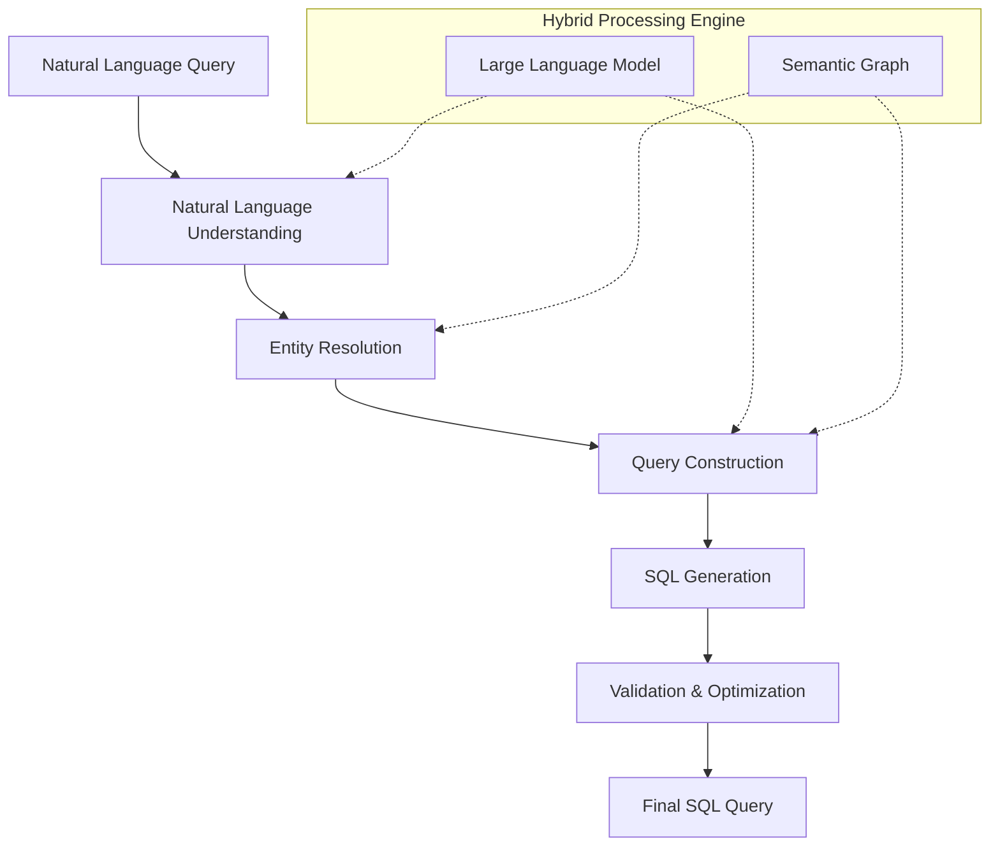

# GraphAlchemy: Query Processing Pipeline

This document details the exact processing stages of GraphAlchemy's query processing pipeline, focusing on the internal representations at each stage and how different components work together to transform natural language into SQL.

## Processing Pipeline Overview



Let's explore each stage in detail with examples of the exact internal representations.

## Stage 1: Natural Language Understanding (NLU)

### Purpose
Extract structured information from the unstructured natural language query.

### Process
1. Tokenize and parse the query
2. Identify entities (tables, columns, values, metrics)
3. Detect operations (filters, joins, aggregations)
4. Determine overall query intent

### Example: "Show me total sales by region for premium customers last quarter"

**Internal Representation:**
```json
{
  "raw_query": "Show me total sales by region for premium customers last quarter",
  "parsed_entities": [
    {
      "text": "total sales",
      "type": "metric",
      "position": [8, 19],
      "confidence": 0.95
    },
    {
      "text": "region",
      "type": "dimension",
      "position": [23, 29],
      "confidence": 0.97
    },
    {
      "text": "premium customers",
      "type": "entity_filter",
      "position": [34, 51],
      "confidence": 0.93
    },
    {
      "text": "last quarter",
      "type": "time_filter",
      "position": [52, 64],
      "confidence": 0.96
    }
  ],
  "detected_operations": [
    {
      "type": "aggregation",
      "subject": "sales",
      "function": "sum",
      "confidence": 0.94
    },
    {
      "type": "grouping",
      "subject": "region",
      "confidence": 0.97
    }
  ],
  "query_intent": {
    "primary_type": "aggregation",
    "secondary_type": "comparison",
    "filtering": "both_entity_and_time",
    "confidence": 0.95
  },
  "linguistic_structure": {
    "visualization_request": true,
    "question_format": false,
    "imperative_command": true
  }
}
```

## Stage 2: Entity Resolution

### Purpose
Map NLU-identified entities to specific database objects using the semantic graph.

### Process
1. For each entity, search the semantic graph
2. Resolve business terms to technical entities
3. Resolve ambiguities using context and confidence scores
4. Identify required joins based on entity relationships

### Example (continuing the previous query)

**Internal Representation:**
```json
{
  "resolved_entities": {
    "metrics": [
      {
        "source_text": "total sales",
        "resolved_to": {
          "type": "business_metric",
          "name": "total_sales",
          "definition": "sum of order amounts",
          "technical_impl": "SUM(orders.amount)",
          "confidence": 0.96
        }
      }
    ],
    "dimensions": [
      {
        "source_text": "region",
        "resolved_to": {
          "type": "column",
          "table": "customers",
          "column": "region",
          "aliases": ["customer_region", "sales_region"],
          "confidence": 0.97
        },
        "alternatives": [
          {
            "type": "column",
            "table": "stores",
            "column": "region",
            "confidence": 0.65
          }
        ]
      }
    ],
    "filters": [
      {
        "source_text": "premium customers",
        "resolved_to": {
          "type": "composite_concept",
          "name": "premium_customers",
          "definition": "customers with lifetime value greater than $10,000",
          "technical_impl": "customers WHERE lifetime_value > 10000",
          "confidence": 0.92
        }
      },
      {
        "source_text": "last quarter",
        "resolved_to": {
          "type": "time_expression",
          "name": "last_quarter",
          "definition": "the previous complete calendar quarter",
          "technical_impl": "BETWEEN DATE_TRUNC('quarter', CURRENT_DATE) - INTERVAL '3 months' AND DATE_TRUNC('quarter', CURRENT_DATE) - INTERVAL '1 day'",
          "confidence": 0.97
        }
      }
    ]
  },
  "required_tables": [
    {
      "name": "customers",
      "alias": "c",
      "required_for": ["region", "premium_customers"],
      "primary": true
    },
    {
      "name": "orders",
      "alias": "o",
      "required_for": ["total_sales", "last_quarter"],
      "primary": false
    }
  ],
  "required_joins": [
    {
      "from_table": "customers",
      "to_table": "orders",
      "join_type": "inner",
      "join_condition": "customers.customer_id = orders.customer_id",
      "path_confidence": 0.99,
      "notes": "direct FK relationship found in schema"
    }
  ]
}
```

## Stage 3: Query Construction

### Purpose
Build a structured query plan that represents the full intent.

### Process
1. Combine resolved entities into a coherent query plan
2. Determine aggregations, groupings, and filters
3. Add necessary joins from the join path calculation
4. Resolve any remaining ambiguities using the LLM

### Example (continuing the previous query)

**Internal Representation:**
```json
{
  "query_plan": {
    "query_type": "select_aggregated",
    "output_columns": [
      {
        "expression": "customers.region",
        "alias": "region",
        "source": "dimension"
      },
      {
        "expression": "SUM(orders.amount)",
        "alias": "total_sales",
        "source": "metric"
      }
    ],
    "from_clause": {
      "base_table": {
        "name": "customers",
        "alias": "c"
      },
      "joins": [
        {
          "table": "orders",
          "alias": "o",
          "type": "inner",
          "condition": "c.customer_id = o.customer_id"
        }
      ]
    },
    "where_clause": {
      "conditions": [
        {
          "type": "comparison",
          "left": "c.lifetime_value",
          "operator": ">",
          "right": 10000,
          "source": "resolved_concept",
          "source_text": "premium customers"
        },
        {
          "type": "between",
          "expression": "o.order_date",
          "start": "DATE_TRUNC('quarter', CURRENT_DATE) - INTERVAL '3 months'",
          "end": "DATE_TRUNC('quarter', CURRENT_DATE) - INTERVAL '1 day'",
          "source": "time_expression",
          "source_text": "last quarter"
        }
      ],
      "logical_operator": "AND"
    },
    "group_by_clause": {
      "expressions": ["c.region"]
    },
    "order_by_clause": {
      "expressions": [
        {
          "expression": "total_sales",
          "direction": "DESC"
        }
      ]
    }
  },
  "ambiguity_resolutions": [
    {
      "entity": "region",
      "options": ["customers.region", "stores.region"],
      "selected": "customers.region",
      "reason": "Context indicates customer-focused analysis",
      "confidence": 0.92
    }
  ],
  "interpretation_confidence": 0.94
}
```

## Stage 4: SQL Generation

### Purpose
Convert the structured query plan into valid SQL.

### Process
1. Generate appropriate SQL syntax for each query component
2. Apply dialect-specific syntax rules
3. Format the SQL for readability
4. Add comments for complex parts of the query

### Example (continuing the previous query)

**Internal Representation:**
```json
{
  "sql_components": {
    "select_clause": "SELECT\n  c.region AS region,\n  SUM(o.amount) AS total_sales",
    "from_clause": "FROM customers c\nINNER JOIN orders o ON c.customer_id = o.customer_id",
    "where_clause": "WHERE c.lifetime_value > 10000\nAND o.order_date BETWEEN DATE_TRUNC('quarter', CURRENT_DATE) - INTERVAL '3 months' AND DATE_TRUNC('quarter', CURRENT_DATE) - INTERVAL '1 day'",
    "group_by_clause": "GROUP BY c.region",
    "order_by_clause": "ORDER BY total_sales DESC"
  },
  "complete_sql": "SELECT\n  c.region AS region,\n  SUM(o.amount) AS total_sales\nFROM customers c\nINNER JOIN orders o ON c.customer_id = o.customer_id\nWHERE c.lifetime_value > 10000\nAND o.order_date BETWEEN DATE_TRUNC('quarter', CURRENT_DATE) - INTERVAL '3 months' AND DATE_TRUNC('quarter', CURRENT_DATE) - INTERVAL '1 day'\nGROUP BY c.region\nORDER BY total_sales DESC",
  "sql_generation_confidence": 0.96,
  "comment": "-- Query: Total sales by region for premium customers last quarter\n-- Premium customers defined as: customers with lifetime value > $10,000\n-- Last quarter: previous complete calendar quarter"
}
```

## Stage 5: Validation & Optimization

### Purpose
Ensure the generated SQL is valid and performs well.

### Process
1. Validate SQL syntax
2. Check for semantic errors
3. Apply performance optimizations
4. Estimate query execution time

### Example (continuing the previous query)

**Internal Representation:**
```json
{
  "validation_results": {
    "syntax_valid": true,
    "semantic_valid": true,
    "all_tables_exist": true,
    "all_columns_exist": true,
    "join_conditions_valid": true
  },
  "optimization_applied": [
    {
      "type": "index_usage_verified",
      "details": "Confirmed indexes exist on customers.customer_id and orders.customer_id"
    },
    {
      "type": "join_order_optimization",
      "details": "Keeping customers as outer table due to filtering on lifetime_value"
    }
  ],
  "execution_estimate": {
    "expected_row_count": "~100-500 rows",
    "estimated_execution_time": "0.8-1.2 seconds",
    "data_volume": "medium"
  },
  "final_sql": "SELECT\n  c.region AS region,\n  SUM(o.amount) AS total_sales\nFROM customers c\nINNER JOIN orders o ON c.customer_id = o.customer_id\nWHERE c.lifetime_value > 10000\nAND o.order_date BETWEEN DATE_TRUNC('quarter', CURRENT_DATE) - INTERVAL '3 months' AND DATE_TRUNC('quarter', CURRENT_DATE) - INTERVAL '1 day'\nGROUP BY c.region\nORDER BY total_sales DESC"
}
```

## Final Response to User

### Purpose
Present the SQL, explanation, and additional insights to the user.

### Process
1. Format the SQL for display
2. Generate a natural language explanation
3. Include any alternative interpretations
4. Provide confidence metrics

### Example (continuing the previous query)

**Response Object:**
```json
{
  "query": "Show me total sales by region for premium customers last quarter",
  "sql": "SELECT\n  c.region AS region,\n  SUM(o.amount) AS total_sales\nFROM customers c\nINNER JOIN orders o ON c.customer_id = o.customer_id\nWHERE c.lifetime_value > 10000\nAND o.order_date BETWEEN DATE_TRUNC('quarter', CURRENT_DATE) - INTERVAL '3 months' AND DATE_TRUNC('quarter', CURRENT_DATE) - INTERVAL '1 day'\nGROUP BY c.region\nORDER BY total_sales DESC",
  "explanation": "This query calculates the total sales amount for each region, but only for premium customers (those with a lifetime value over $10,000) and only considering orders from the previous calendar quarter. The results are sorted with the highest-selling regions first.",
  "confidence": 0.94,
  "entity_mappings": [
    {"text": "total sales", "mapped_to": "SUM(orders.amount)"},
    {"text": "region", "mapped_to": "customers.region"},
    {"text": "premium customers", "mapped_to": "customers with lifetime_value > 10000"},
    {"text": "last quarter", "mapped_to": "previous complete calendar quarter"}
  ],
  "alternative_interpretations": [
    {
      "description": "Using store regions instead of customer regions",
      "sql_summary": "Would join to stores table and group by stores.region",
      "confidence": 0.65
    }
  ],
  "execution_info": {
    "estimated_rows": "~100-500 rows",
    "execution_time": "~1 second"
  }
}
```

## Detailed Processing of Complex Concepts

Let's examine how GraphAlchemy processes complex queries with composite business concepts:

**Query:** "Identify at-risk accounts with declining engagement"

### Stage 1: NLU

```json
{
  "parsed_entities": [
    {
      "text": "at-risk accounts",
      "type": "composite_entity",
      "confidence": 0.91
    },
    {
      "text": "declining engagement",
      "type": "trend_pattern",
      "confidence": 0.89
    }
  ],
  "query_intent": {
    "primary_type": "identification",
    "trend_analysis": true,
    "confidence": 0.92
  }
}
```

### Stage 2: Entity Resolution (Semantic Graph Lookup)

```json
{
  "resolved_entities": {
    "composite_entities": [
      {
        "source_text": "at-risk accounts",
        "resolved_to": {
          "type": "business_concept",
          "name": "at_risk_accounts",
          "definition": "accounts that have high value but show warning signs",
          "attributes": [
            {"name": "high_value", "definition": "accounts.annual_value > 50000"},
            {"name": "warning_signs", "definition": "one or more of: payment_delays, support_escalations, negative_feedback"}
          ],
          "confidence": 0.93
        }
      }
    ],
    "trend_patterns": [
      {
        "source_text": "declining engagement",
        "resolved_to": {
          "type": "temporal_pattern",
          "name": "declining_engagement",
          "definition": "decreasing trend in activity metrics over time",
          "measurement": "activity_score",
          "time_window": "last 3 months",
          "direction": "decreasing",
          "table": "account_activities",
          "confidence": 0.91
        }
      }
    ]
  },
  "required_tables": [
    {"name": "accounts", "alias": "a"},
    {"name": "account_activities", "alias": "aa"},
    {"name": "payments", "alias": "p"},
    {"name": "support_tickets", "alias": "st"},
    {"name": "feedback", "alias": "f"}
  ],
  "required_joins": [
    {"from": "accounts", "to": "account_activities", "on": "accounts.account_id = account_activities.account_id"},
    {"from": "accounts", "to": "payments", "on": "accounts.account_id = payments.account_id"},
    {"from": "accounts", "to": "support_tickets", "on": "accounts.account_id = support_tickets.account_id"},
    {"from": "accounts", "to": "feedback", "on": "accounts.account_id = feedback.account_id"}
  ]
}
```

### Stage 3: Query Construction

Here, the LLM helps to interpret the temporal aspect:

```json
{
  "query_plan": {
    "query_type": "select_with_analytics",
    "with_clauses": [
      {
        "name": "engagement_trends",
        "query": {
          "select": [
            "account_id", 
            "DATE_TRUNC('month', activity_date) AS month",
            "SUM(activity_score) AS monthly_score"
          ],
          "from": "account_activities",
          "where": "activity_date >= CURRENT_DATE - INTERVAL '3 months'",
          "group_by": ["account_id", "DATE_TRUNC('month', activity_date)"]
        }
      },
      {
        "name": "declining_accounts",
        "query": {
          "select": [
            "account_id",
            "REGR_SLOPE(monthly_score, EXTRACT(EPOCH FROM month)) AS engagement_slope"
          ],
          "from": "engagement_trends",
          "group_by": ["account_id"],
          "having": "REGR_SLOPE(monthly_score, EXTRACT(EPOCH FROM month)) < 0"
        }
      }
    ],
    "output_columns": [
      {"expression": "a.account_id", "alias": "account_id"},
      {"expression": "a.account_name", "alias": "account_name"},
      {"expression": "a.annual_value", "alias": "annual_value"},
      {"expression": "da.engagement_slope", "alias": "engagement_trend"},
      {"expression": "CASE WHEN p.late_payments > 0 THEN true ELSE false END", "alias": "has_payment_delays"},
      {"expression": "CASE WHEN st.escalations > 0 THEN true ELSE false END", "alias": "has_escalations"},
      {"expression": "CASE WHEN f.negative_score > 3 THEN true ELSE false END", "alias": "has_negative_feedback"}
    ],
    "from_clause": {
      "base_table": {"name": "accounts", "alias": "a"},
      "joins": [
        {"table": "declining_accounts", "alias": "da", "type": "inner", "condition": "a.account_id = da.account_id"},
        {
          "table": "(SELECT account_id, COUNT(*) as late_payments FROM payments WHERE payment_date > due_date AND payment_date > CURRENT_DATE - INTERVAL '90 days' GROUP BY account_id)",
          "alias": "p",
          "type": "left",
          "condition": "a.account_id = p.account_id"
        },
        {
          "table": "(SELECT account_id, COUNT(*) as escalations FROM support_tickets WHERE priority = 'high' AND created_date > CURRENT_DATE - INTERVAL '90 days' GROUP BY account_id)",
          "alias": "st",
          "type": "left",
          "condition": "a.account_id = st.account_id"
        },
        {
          "table": "(SELECT account_id, AVG(sentiment_score) as negative_score FROM feedback WHERE sentiment_score < 0 AND feedback_date > CURRENT_DATE - INTERVAL '90 days' GROUP BY account_id)",
          "alias": "f",
          "type": "left",
          "condition": "a.account_id = f.account_id"
        }
      ]
    },
    "where_clause": {
      "conditions": [
        {"expression": "a.annual_value > 50000"}
      ]
    },
    "order_by_clause": {
      "expressions": [
        {"expression": "da.engagement_slope", "direction": "ASC"},
        {"expression": "a.annual_value", "direction": "DESC"}
      ]
    }
  }
}
```

### Stage 4 & 5: SQL Generation, Validation, Optimization

```json
{
  "final_sql": "WITH engagement_trends AS (\n  SELECT\n    account_id,\n    DATE_TRUNC('month', activity_date) AS month,\n    SUM(activity_score) AS monthly_score\n  FROM account_activities\n  WHERE activity_date >= CURRENT_DATE - INTERVAL '3 months'\n  GROUP BY account_id, DATE_TRUNC('month', activity_date)\n),\ndeclining_accounts AS (\n  SELECT\n    account_id,\n    REGR_SLOPE(monthly_score, EXTRACT(EPOCH FROM month)) AS engagement_slope\n  FROM engagement_trends\n  GROUP BY account_id\n  HAVING REGR_SLOPE(monthly_score, EXTRACT(EPOCH FROM month)) < 0\n)\nSELECT\n  a.account_id,\n  a.account_name,\n  a.annual_value,\n  da.engagement_slope AS engagement_trend,\n  CASE WHEN p.late_payments > 0 THEN true ELSE false END AS has_payment_delays,\n  CASE WHEN st.escalations > 0 THEN true ELSE false END AS has_escalations,\n  CASE WHEN f.negative_score > 3 THEN true ELSE false END AS has_negative_feedback\nFROM accounts a\nINNER JOIN declining_accounts da ON a.account_id = da.account_id\nLEFT JOIN (\n  SELECT account_id, COUNT(*) as late_payments \n  FROM payments \n  WHERE payment_date > due_date AND payment_date > CURRENT_DATE - INTERVAL '90 days' \n  GROUP BY account_id\n) p ON a.account_id = p.account_id\nLEFT JOIN (\n  SELECT account_id, COUNT(*) as escalations \n  FROM support_tickets \n  WHERE priority = 'high' AND created_date > CURRENT_DATE - INTERVAL '90 days' \n  GROUP BY account_id\n) st ON a.account_id = st.account_id\nLEFT JOIN (\n  SELECT account_id, AVG(sentiment_score) as negative_score \n  FROM feedback \n  WHERE sentiment_score < 0 AND feedback_date > CURRENT_DATE - INTERVAL '90 days' \n  GROUP BY account_id\n) f ON a.account_id = f.account_id\nWHERE a.annual_value > 50000\nORDER BY da.engagement_slope ASC, a.annual_value DESC",
  "validation_results": {
    "syntax_valid": true,
    "semantic_valid": true,
    "complexity_metrics": {
      "tables_joined": 5,
      "with_clauses": 2,
      "subqueries": 3,
      "analytical_functions": 1
    }
  },
  "optimization_notes": "Query uses regression analysis for trend detection instead of manual calculations"
}
```

## The Collaborative Process Between LLM and Semantic Graph

Throughout the query processing pipeline, GraphAlchemy leverages both the LLM and semantic graph in complementary ways:

### Entity Resolution Stage

**Semantic Graph provides:**
- Precise mappings between business terms and technical entities
- Relationship paths between tables
- Confidence scores for ambiguous mappings
- Composite concept definitions

**LLM assists with:**
- Resolving linguistic ambiguities
- Understanding contextual nuances
- Interpreting novel combinations of terms

### Example of Graph/LLM Collaboration: Ambiguous Term Resolution

When a term like "sales" is ambiguous, the process works like this:

1. **Graph lookup** finds multiple possible mappings:
   ```
   "sales" → "sales" table (confidence: 0.75)
   "sales" → "order_items.amount" column (confidence: 0.68)
   "sales" → "total_sales" metric (confidence: 0.82)
   ```

2. **LLM analyzes context**:
   ```
   Context analysis: "Show me sales by region" implies aggregation
   Context score for "total_sales" metric: +0.15
   ```

3. **Combined decision**:
   ```
   Final resolution: "sales" → "total_sales" metric (confidence: 0.97)
   ```

### Query Construction Stage

**Semantic Graph provides:**
- Join paths between required tables
- Implementation details for business metrics
- Technical patterns for composite concepts

**LLM contributes:**
- Understanding how to structure complex queries
- Inferring implicit intent (sorting, limits, etc.)
- Creating expressions for complex analytical functions

## Internal Processing of Advanced Natural Language Elements

GraphAlchemy's internal processing handles sophisticated language constructs:

### Example: Comparative Queries

**Query:** "Which product category has improved the most in sales since last year?"

**NLU Processing:**
```json
{
  "comparative_analysis": {
    "type": "superlative",
    "measure": "improvement",
    "subject": "product_category",
    "metric": "sales",
    "time_comparison": {
      "current_period": "current_year",
      "baseline_period": "last_year",
      "comparator": "since"
    }
  }
}
```

**Query Construction:**
```json
{
  "query_plan": {
    "with_clauses": [
      {
        "name": "last_year_sales",
        "select": ["category_id", "SUM(amount) AS sales"],
        "from": "sales",
        "where": "sale_date BETWEEN DATE_TRUNC('year', CURRENT_DATE - INTERVAL '1 year') AND DATE_TRUNC('year', CURRENT_DATE) - INTERVAL '1 day'",
        "group_by": ["category_id"]
      },
      {
        "name": "current_year_sales",
        "select": ["category_id", "SUM(amount) AS sales"],
        "from": "sales",
        "where": "sale_date >= DATE_TRUNC('year', CURRENT_DATE)",
        "group_by": ["category_id"]
      },
      {
        "name": "sales_comparison",
        "select": [
          "c.category_id",
          "c.category_name",
          "cy.sales AS current_sales",
          "ly.sales AS last_year_sales",
          "cy.sales - ly.sales AS absolute_increase",
          "CASE WHEN ly.sales > 0 THEN (cy.sales - ly.sales) / ly.sales * 100 ELSE NULL END AS percentage_increase"
        ],
        "from": "categories c",
        "joins": [
          {"to": "current_year_sales cy", "on": "c.category_id = cy.category_id"},
          {"to": "last_year_sales ly", "on": "c.category_id = ly.category_id"}
        ]
      }
    ],
    "output_columns": [
      {"expression": "category_name", "alias": "category"},
      {"expression": "current_sales", "alias": "current_year_sales"},
      {"expression": "last_year_sales", "alias": "last_year_sales"},
      {"expression": "absolute_increase", "alias": "increase"},
      {"expression": "percentage_increase", "alias": "percentage_improvement"}
    ],
    "from": "sales_comparison",
    "order_by": [
      {"expression": "percentage_increase", "direction": "DESC"}
    ],
    "limit": 1
  }
}
```

## Conclusion

Through this detailed examination of GraphAlchemy's query processing pipeline, we've seen how:

1. The system transforms natural language through a series of well-defined stages
2. Internal representations maintain structure and traceability at each step
3. The semantic graph and LLM work together to resolve entities and build queries
4. Complex business concepts are resolved using graph lookups and linguistic context
5. Advanced query patterns like comparative analysis are handled through sophisticated internal structures

This approach enables GraphAlchemy to handle queries ranging from simple to highly complex, all while maintaining explainability and accuracy. By leveraging the strengths of both semantic graphs and language models, the system provides a truly intuitive and powerful natural language interface to data.