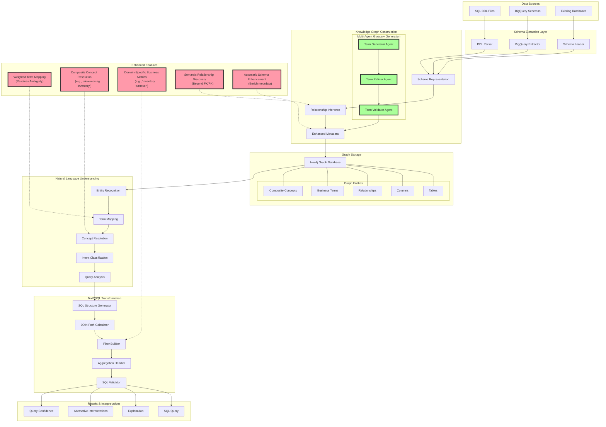

# Semantic Graph-Based Text2SQL Architecture

## Comprehensive Flow Diagram

## Key Value Propositions

### 1. Multi-Agent Business Glossary Generation
- **Problem Solved**: Traditional systems struggle with business terminology that differs from technical schema names
- **Novel Approach**: Uses specialized agents (Generator → Refiner → Validator) working in sequence to:
  - Generate initial business terms from schema
  - Refine and enrich definitions and mappings
  - Validate technical mappings with confidence scores
- **Business Value**: Enables business users to query using familiar terminology without technical knowledge

### 2. Composite Concept Resolution
- **Problem Solved**: Simple keyword mapping fails to handle complex business concepts
- **Novel Approach**: Recognizes and resolves composite business concepts like "slow-moving inventory" or "reliable suppliers"
- **Business Value**: Users can express queries naturally using domain concepts rather than technical specifications

### 3. Graph-Based Schema Understanding
- **Problem Solved**: Traditional text2sql misses implicit relationships and semantic meaning
- **Novel Approach**: Stores schema as rich knowledge graph with semantic relationship inference
- **Business Value**: Enables complex multi-table joins without explicit relationship modeling

### 4. Domain-Specific Intelligence
- **Problem Solved**: Generic SQL generation lacks domain context for meaningful queries
- **Novel Approach**: Encodes domain knowledge as part of the business glossary and concept resolution
- **Business Value**: Generates more relevant and accurate SQL for specific business domains

### 5. Weighted Term Mapping
- **Problem Solved**: Ambiguity when business terms map to multiple tables/columns
- **Novel Approach**: Assigns confidence scores to term mappings, enabling probabilistic resolution
- **Business Value**: More accurate query resolution, especially for terms with different meanings across contexts

## System Unique Differentiators

1. **Transparent Processing Pipeline**: Each step from NL understanding to SQL generation is explainable and traceable

2. **Self-Enriching Knowledge Graph**: System automatically enhances metadata through usage patterns

3. **Hybrid LLM/Graph Approach**: Combines semantic understanding of LLMs with structured knowledge in graph database

4. **Domain Adaptation**: Framework easily adapts to new business domains through glossary generation

5. **Confidence Scoring**: Provides confidence levels for mappings and interpretations, enabling better decision support