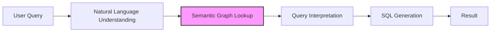

# GraphAlchemy: User Flow Walkthrough

This document provides a detailed walkthrough of how GraphAlchemy processes natural language queries of varying complexity. We'll examine real examples to illustrate how the system leverages its semantic graph and hybrid architecture to transform natural language into accurate SQL.

## Query Processing Journey

When a user submits a natural language query to GraphAlchemy, it embarks on a sophisticated journey through several processing stages:



Let's explore this journey through concrete examples of increasing complexity.

## Example 1: Simple Single-Table Query

**User Query:** "Show me all products with price greater than 100"

### Step 1: Natural Language Understanding (NLU)

The NLU module parses the query to identify key components:

```json
{
  "entities": [
    {"text": "products", "type": "table_or_concept", "confidence": 0.98},
    {"text": "price", "type": "attribute", "confidence": 0.95},
    {"text": "100", "type": "value", "confidence": 1.0}
  ],
  "operations": [
    {"type": "comparison", "operator": "greater than", "confidence": 0.97}
  ],
  "intent": {"type": "selection", "confidence": 0.99}
}
```

### Step 2: Semantic Graph Lookup

The system queries the semantic graph to resolve identified entities:

```
MATCH (t:Table {name: 'products'}) RETURN t
MATCH (c:Column)-[:BELONGS_TO]->(t:Table {name: 'products'}) 
WHERE c.name = 'price' OR 'price' IN c.synonyms 
RETURN c
```

The graph returns:
- Table: "products" is mapped to the Products table
- Attribute: "price" is mapped to the "unit_price" column in the Products table
- Operation: "greater than" translates to ">" in SQL

### Step 3: Query Interpretation

The system builds a structured representation of the query:

```json
{
  "selection": {
    "target_table": "products",
    "attributes": ["*"],
    "filters": [
      {"attribute": "unit_price", "operator": ">", "value": 100}
    ]
  }
}
```

### Step 4: SQL Generation

From this interpretation, the SQL generator produces:

```sql
SELECT * FROM products WHERE unit_price > 100
```

### Step 5: Result Delivery

The system returns the SQL, explanation, and results:

```json
{
  "sql": "SELECT * FROM products WHERE unit_price > 100",
  "explanation": "This query retrieves all columns from the products table where the unit price is greater than 100.",
  "confidence": 0.97
}
```

## Example 2: Multi-Table Join with Business Terminology

**User Query:** "Find customers who have purchased premium products"

This query introduces complexity through business terminology ("premium products") and the need for joining multiple tables.

### Step 1: Natural Language Understanding

```json
{
  "entities": [
    {"text": "customers", "type": "table_or_concept", "confidence": 0.98},
    {"text": "purchased", "type": "relationship", "confidence": 0.94},
    {"text": "premium products", "type": "concept", "confidence": 0.92}
  ],
  "intent": {"type": "selection_with_join", "confidence": 0.95}
}
```

### Step 2: Semantic Graph Lookup

The system performs multiple lookups in the semantic graph:

1. Resolving "customers":
```
MATCH (t:Table {name: 'customers'}) RETURN t
```

2. Resolving "purchased" relationship:
```
MATCH p=(:Table {name: 'customers'})-[r:LIKELY_REFERENCES*1..3]->(:Table {name: 'orders'})
RETURN p ORDER BY r.confidence DESC LIMIT 1
```

3. Resolving the composite concept "premium products":
```
MATCH (c:CompositeConcept {name: 'premium_products'})
RETURN c.definition, c.query_pattern
```

The graph returns:
- "customers" maps to the Customers table
- "purchased" implies a relationship path: Customers → Orders → OrderItems → Products
- "premium products" is a composite concept defined as "products with unit_price > 1000 OR category = 'luxury'"

### Step 3: Query Interpretation

```json
{
  "selection": {
    "target_table": "customers",
    "attributes": ["customers.*"],
    "joins": [
      {"from": "customers", "to": "orders", "type": "inner", "on": "customers.customer_id = orders.customer_id"},
      {"from": "orders", "to": "order_items", "type": "inner", "on": "orders.order_id = order_items.order_id"},
      {"from": "order_items", "to": "products", "type": "inner", "on": "order_items.product_id = products.product_id"}
    ],
    "filters": [
      {"type": "composite", "pattern": "(products.unit_price > 1000 OR products.category = 'luxury')"}
    ],
    "distinct": true
  }
}
```

### Step 4: SQL Generation

```sql
SELECT DISTINCT customers.* 
FROM customers
INNER JOIN orders ON customers.customer_id = orders.customer_id
INNER JOIN order_items ON orders.order_id = order_items.order_id
INNER JOIN products ON order_items.product_id = products.product_id
WHERE (products.unit_price > 1000 OR products.category = 'luxury')
```

### Step 5: Result Delivery

```json
{
  "sql": "SELECT DISTINCT customers.* FROM customers...",
  "explanation": "This query finds all customers who have placed orders for premium products, defined as products that either cost more than $1000 or belong to the luxury category.",
  "confidence": 0.92
}
```

## Example 3: Aggregation Query with Time Component

**User Query:** "What was the average order value by month last year?"

This query introduces aggregation and time-based analysis.

### Step 1: Natural Language Understanding

```json
{
  "entities": [
    {"text": "average order value", "type": "metric", "confidence": 0.93},
    {"text": "month", "type": "time_unit", "confidence": 0.97},
    {"text": "last year", "type": "time_period", "confidence": 0.96}
  ],
  "intent": {"type": "aggregation_with_time", "confidence": 0.94}
}
```

### Step 2: Semantic Graph Lookup

1. Resolving the metric "average order value":
```
MATCH (m:BusinessMetric {name: 'average_order_value'})
RETURN m.definition, m.calculation_pattern
```

2. Determining relevant tables for the metric:
```
MATCH (m:BusinessMetric {name: 'average_order_value'})-[:DERIVED_FROM]->(t:Table)
RETURN t.name
```

3. Resolving the time component:
```
MATCH (t:Table)-[:HAS_COLUMN]->(c:Column)
WHERE t.name IN ['orders'] AND c.concept_tags CONTAINS 'date'
RETURN c.name, c.data_type
```

The graph returns:
- "average order value" is defined as "SUM(order_items.quantity * order_items.unit_price) / COUNT(DISTINCT orders.order_id)"
- Relevant tables: Orders, OrderItems
- Time column: orders.order_date (timestamp/date type)
- "last year" resolves to "YEAR(CURRENT_DATE) - 1"

### Step 3: Query Interpretation

```json
{
  "aggregation": {
    "metrics": [
      {
        "name": "average_order_value",
        "expression": "SUM(order_items.quantity * order_items.unit_price) / COUNT(DISTINCT orders.order_id)",
        "alias": "average_order_value"
      }
    ],
    "grouping": [
      {"time_function": "DATE_TRUNC('month', orders.order_date)", "alias": "month"}
    ],
    "tables": ["orders", "order_items"],
    "joins": [
      {"from": "orders", "to": "order_items", "type": "inner", "on": "orders.order_id = order_items.order_id"}
    ],
    "filters": [
      {"attribute": "orders.order_date", "operator": ">=", "value": "DATE_TRUNC('year', CURRENT_DATE - INTERVAL '1 year')"},
      {"attribute": "orders.order_date", "operator": "<", "value": "DATE_TRUNC('year', CURRENT_DATE)"}
    ],
    "ordering": [
      {"attribute": "month", "direction": "ASC"}
    ]
  }
}
```

### Step 4: SQL Generation

```sql
SELECT 
  DATE_TRUNC('month', orders.order_date) AS month,
  SUM(order_items.quantity * order_items.unit_price) / COUNT(DISTINCT orders.order_id) AS average_order_value
FROM orders
INNER JOIN order_items ON orders.order_id = order_items.order_id
WHERE orders.order_date >= DATE_TRUNC('year', CURRENT_DATE - INTERVAL '1 year')
  AND orders.order_date < DATE_TRUNC('year', CURRENT_DATE)
GROUP BY DATE_TRUNC('month', orders.order_date)
ORDER BY month ASC
```

### Step 5: Result Delivery

```json
{
  "sql": "SELECT DATE_TRUNC('month', orders.order_date) AS month...",
  "explanation": "This query calculates the average order value for each month of the previous year. The average order value is calculated by dividing the total value of all order items by the number of unique orders.",
  "confidence": 0.91
}
```

## Example 4: Ambiguous Query with Multiple Interpretations

**User Query:** "Show me sales by category"

This query is ambiguous because "sales" and "category" could refer to multiple concepts in the database.

### Step 1: Natural Language Understanding

```json
{
  "entities": [
    {"text": "sales", "type": "metric_or_table", "confidence": 0.90},
    {"text": "category", "type": "attribute_or_table", "confidence": 0.88}
  ],
  "intent": {"type": "aggregation_or_selection", "confidence": 0.85}
}
```

### Step 2: Semantic Graph Lookup

The system identifies multiple possible interpretations:

1. "sales" could refer to:
   - The Sales table
   - The "total_sales" metric (sum of order values)
   - The "sales_amount" column in OrderItems

2. "category" could refer to:
   - The Categories table
   - The "category" column in Products
   - The "category_name" column in Categories

The system queries the graph to find all possible mappings and their confidence scores:

```
MATCH (t:Table) WHERE t.name = 'sales' OR 'sales' IN t.synonyms RETURN t, 0.8 as confidence
UNION
MATCH (m:BusinessMetric) WHERE m.name = 'total_sales' OR 'sales' IN m.synonyms RETURN m, 0.9 as confidence
UNION
MATCH (c:Column) WHERE c.name = 'sales_amount' OR 'sales' IN c.synonyms RETURN c, 0.7 as confidence

MATCH (t:Table) WHERE t.name = 'categories' OR 'category' IN t.synonyms RETURN t, 0.8 as confidence
UNION
MATCH (c:Column) WHERE c.name = 'category' OR c.name = 'category_name' OR 'category' IN c.synonyms RETURN c, 0.85 as confidence
```

The system also looks for join paths between the various entity combinations:

```
MATCH p=(:Table {name: 'products'})-[*1..3]->(:Table {name: 'categories'})
RETURN p, REDUCE(s = 1.0, r in relationships(p) | s * r.confidence) AS path_confidence
```

### Step 3: Query Interpretation

The system generates multiple interpretations ranked by confidence:

**Interpretation 1 (Highest Confidence):**
```json
{
  "aggregation": {
    "metrics": [
      {"expression": "SUM(order_items.quantity * order_items.unit_price)", "alias": "total_sales"}
    ],
    "grouping": [
      {"attribute": "categories.category_name", "alias": "category"}
    ],
    "tables": ["order_items", "products", "categories"],
    "joins": [
      {"from": "order_items", "to": "products", "on": "order_items.product_id = products.product_id"},
      {"from": "products", "to": "categories", "on": "products.category_id = categories.category_id"}
    ]
  }
}
```

**Interpretation 2:**
```json
{
  "selection": {
    "target_table": "sales",
    "attributes": ["sales.*"],
    "grouping": [
      {"attribute": "sales.category", "alias": "category"}
    ]
  }
}
```

### Step 4: SQL Generation

For the primary interpretation:

```sql
SELECT 
  categories.category_name AS category,
  SUM(order_items.quantity * order_items.unit_price) AS total_sales
FROM order_items
INNER JOIN products ON order_items.product_id = products.product_id
INNER JOIN categories ON products.category_id = categories.category_id
GROUP BY categories.category_name
ORDER BY total_sales DESC
```

### Step 5: Result Delivery

```json
{
  "sql": "SELECT categories.category_name AS category, SUM(order_items.quantity * order_items.unit_price) AS total_sales...",
  "explanation": "This query calculates the total sales amount for each product category by summing the value of all order items and grouping by category name.",
  "confidence": 0.87,
  "alternative_interpretations": [
    {
      "sql": "SELECT sales.category, COUNT(*) FROM sales GROUP BY sales.category",
      "explanation": "This alternative interpretation assumes 'sales' refers to a sales table with a category column, and counts records by category.",
      "confidence": 0.72
    }
  ]
}
```

## Example 5: Vague Query Requiring Clarification

**User Query:** "Show top performers"

This query is vague and requires the system to make assumptions based on context or ask for clarification.

### Step 1: Natural Language Understanding

```json
{
  "entities": [
    {"text": "top performers", "type": "vague_concept", "confidence": 0.75}
  ],
  "intent": {"type": "selection_with_ranking", "confidence": 0.78},
  "ambiguity_level": "high"
}
```

### Step 2: Semantic Graph Lookup

The system searches for possible interpretations of "top performers":

```
MATCH (c:CompositeConcept) WHERE c.name CONTAINS 'top' AND c.name CONTAINS 'perform'
RETURN c, c.definition, c.context

MATCH (t:GlossaryTerm) WHERE t.name CONTAINS 'top' AND t.name CONTAINS 'perform'
RETURN t, t.definition, t.context
```

The graph might return multiple possible contexts:
1. Top performing sales representatives (by revenue)
2. Top performing products (by sales volume)
3. Top performing stores (by profit)

### Step 3: Hybrid LLM/Graph Approach

At this point, the system uses its LLM component to:
1. Analyze the user's historical queries for context
2. Reference the most commonly used "top performer" concept in the organization
3. Generate clarifying questions

The LLM might determine that in this organization, "top performers" most commonly refers to sales representatives:

```
Based on query history analysis, "top performers" in organization context = "sales representatives with highest sales revenue in current quarter"
Confidence: 0.68 (below threshold for automatic resolution)
```

### Step 4: Query Resolution

Due to the high ambiguity and low confidence, the system generates a clarification response:

```json
{
  "needs_clarification": true,
  "clarification_message": "I'm not sure what you mean by 'top performers'. Did you mean:",
  "options": [
    "Top performing sales representatives by revenue",
    "Top performing products by sales volume",
    "Top performing stores by profit"
  ],
  "tentative_sql": "SELECT sales_reps.name, SUM(orders.total_amount) AS total_sales FROM sales_reps JOIN orders ON sales_reps.id = orders.sales_rep_id WHERE orders.order_date >= DATE_TRUNC('quarter', CURRENT_DATE) GROUP BY sales_reps.name ORDER BY total_sales DESC LIMIT 10",
  "confidence": 0.68
}
```

Once the user clarifies (let's assume they select option 1), the system proceeds with the appropriate SQL generation.

## Example 6: Complex Business Concept Query

**User Query:** "Identify potential stockouts in the next 30 days"

This query involves complex business logic, predictive elements, and multiple tables.

### Step 1: Natural Language Understanding

```json
{
  "entities": [
    {"text": "potential stockouts", "type": "complex_concept", "confidence": 0.92},
    {"text": "next 30 days", "type": "time_period", "confidence": 0.98}
  ],
  "intent": {"type": "predictive_analysis", "confidence": 0.93}
}
```

### Step 2: Semantic Graph Lookup

1. Resolving the complex concept "potential stockouts":
```
MATCH (c:CompositeConcept {name: 'potential_stockouts'})
RETURN c.definition, c.query_pattern, c.required_tables
```

The graph returns:
- Definition: "Products where current inventory level minus forecasted demand over a given period falls below the safety stock level"
- Required tables: Products, Inventory, SalesHistory, ForecastParameters
- Query pattern includes calculation logic for forecasting

2. Resolving time component:
```
MATCH (t:TimeExpression {name: 'next_n_days'})
RETURN t.sql_pattern
```

### Step 3: Query Interpretation with LLM Assistance

This complex query requires the LLM to help build the complete interpretation:

```json
{
  "complex_analysis": {
    "concept": "potential_stockouts",
    "time_window": "CURRENT_DATE + INTERVAL '30 days'",
    "base_tables": ["products", "inventory", "sales_history"],
    "calculations": [
      {
        "name": "current_inventory",
        "expression": "inventory.quantity_on_hand",
        "alias": "current_inventory"
      },
      {
        "name": "forecasted_demand",
        "expression": "AVG(sales_history.daily_sales) * 30",
        "lookback_window": "90 days",
        "alias": "forecasted_demand"
      },
      {
        "name": "safety_stock",
        "expression": "products.safety_stock_level",
        "alias": "safety_stock"
      },
      {
        "name": "days_until_stockout",
        "expression": "CASE WHEN forecasted_demand > 0 THEN current_inventory / (forecasted_demand / 30) ELSE NULL END",
        "alias": "days_until_stockout"
      }
    ],
    "filters": [
      {"expression": "days_until_stockout <= 30 AND days_until_stockout > 0"}
    ],
    "ordering": [
      {"attribute": "days_until_stockout", "direction": "ASC"}
    ]
  }
}
```

### Step 4: SQL Generation

The SQL generator creates a complex query with derived tables for forecasting:

```sql
WITH daily_sales AS (
  SELECT 
    product_id, 
    DATE_TRUNC('day', sale_date) AS sale_day,
    SUM(quantity_sold) AS daily_quantity
  FROM sales_history
  WHERE sale_date >= CURRENT_DATE - INTERVAL '90 days'
  GROUP BY product_id, DATE_TRUNC('day', sale_date)
),
product_forecast AS (
  SELECT 
    product_id,
    AVG(daily_quantity) AS avg_daily_demand,
    AVG(daily_quantity) * 30 AS forecasted_30_day_demand
  FROM daily_sales
  GROUP BY product_id
)
SELECT 
  p.product_id,
  p.product_name,
  i.quantity_on_hand AS current_inventory,
  pf.avg_daily_demand,
  pf.forecasted_30_day_demand,
  p.safety_stock_level,
  CASE 
    WHEN pf.avg_daily_demand > 0 
    THEN i.quantity_on_hand / pf.avg_daily_demand 
    ELSE NULL 
  END AS days_until_stockout
FROM products p
JOIN inventory i ON p.product_id = i.product_id
LEFT JOIN product_forecast pf ON p.product_id = pf.product_id
WHERE 
  CASE 
    WHEN pf.avg_daily_demand > 0 
    THEN i.quantity_on_hand / pf.avg_daily_demand <= 30 
         AND i.quantity_on_hand / pf.avg_daily_demand > 0
         AND i.quantity_on_hand <= p.safety_stock_level
    ELSE false
  END
ORDER BY days_until_stockout ASC
```

### Step 5: Result Delivery

```json
{
  "sql": "WITH daily_sales AS (SELECT product_id, DATE_TRUNC('day', sale_date)...",
  "explanation": "This query identifies products at risk of stockout within the next 30 days by:
  1. Calculating the average daily demand based on the last 90 days of sales history
  2. Projecting this demand forward for 30 days
  3. Comparing current inventory to projected demand and safety stock levels
  4. Estimating the number of days until stock is depleted
  The results are sorted with the most urgent potential stockouts first.",
  "confidence": 0.88
}
```

## Example 7: Natural Language Query with Composite Filtering

**User Query:** "Find loyal customers who haven't ordered recently"

This query combines multiple concepts: "loyal customers" and "ordered recently".

### Step 1: Natural Language Understanding

```json
{
  "entities": [
    {"text": "loyal customers", "type": "composite_concept", "confidence": 0.91},
    {"text": "haven't ordered recently", "type": "negated_recency", "confidence": 0.93}
  ],
  "intent": {"type": "selection_with_complex_filter", "confidence": 0.94}
}
```

### Step 2: Semantic Graph Lookup

The system looks up the meaning of composite concepts:

```
MATCH (c:CompositeConcept {name: 'loyal_customer'})
RETURN c.definition, c.query_pattern

MATCH (c:CompositeConcept {name: 'recent_order'})
RETURN c.definition, c.query_pattern
```

The graph returns:
- "loyal customers" = "customers with lifetime order value > $1000 OR order frequency > 1 per month over past year"
- "ordered recently" = "has order within last 30 days"

### Step 3: Structured Interpretation

GraphAlchemy builds an internal representation combining these concepts:

```json
{
  "selection": {
    "target_table": "customers",
    "attributes": ["customers.*"],
    "joins": [
      {"from": "customers", "to": "orders", "type": "left", "on": "customers.customer_id = orders.customer_id"}
    ],
    "complex_filters": [
      {
        "concept": "loyal_customer",
        "expression": "(SELECT SUM(total_amount) FROM orders o WHERE o.customer_id = customers.customer_id) > 1000 OR (SELECT COUNT(*) FROM orders o WHERE o.customer_id = customers.customer_id AND o.order_date >= DATE_TRUNC('year', CURRENT_DATE - INTERVAL '1 year')) >= 12"
      },
      {
        "concept": "recent_order",
        "negated": true,
        "expression": "NOT EXISTS (SELECT 1 FROM orders o WHERE o.customer_id = customers.customer_id AND o.order_date >= CURRENT_DATE - INTERVAL '30 days')"
      }
    ]
  }
}
```

### Step 4: SQL Generation

```sql
SELECT c.*
FROM customers c
LEFT JOIN orders o ON c.customer_id = o.customer_id
WHERE 
  (
    (SELECT SUM(total_amount) FROM orders o2 WHERE o2.customer_id = c.customer_id) > 1000
    OR
    (SELECT COUNT(*) FROM orders o3 WHERE o3.customer_id = c.customer_id AND o3.order_date >= DATE_TRUNC('year', CURRENT_DATE - INTERVAL '1 year')) >= 12
  )
  AND
  NOT EXISTS (
    SELECT 1 FROM orders o4 
    WHERE o4.customer_id = c.customer_id AND o4.order_date >= CURRENT_DATE - INTERVAL '30 days'
  )
GROUP BY c.customer_id
```

### Step 5: Result Delivery

```json
{
  "sql": "SELECT c.* FROM customers c LEFT JOIN orders o ON c.customer_id = o.customer_id WHERE...",
  "explanation": "This query finds loyal customers (those who have spent over $1000 lifetime or have ordered at least monthly for the past year) who haven't placed any orders in the last 30 days.",
  "confidence": 0.90
}
```

## How GraphAlchemy Leverages its Hybrid Architecture

Throughout these examples, we can see how GraphAlchemy's hybrid approach provides significant advantages:

### 1. Semantic Graph Powers Entity Resolution

The semantic graph provides:
- Precise mapping between natural language terms and technical entities
- Understanding of business concepts and their technical implementations
- Knowledge of join paths and relationships between entities
- Confidence scoring for ambiguous mappings

### 2. LLM Handles Linguistic Complexity

The LLM component excels at:
- Understanding complex linguistic patterns in queries
- Resolving ambiguous language
- Generating clarification questions when needed
- Creating natural language explanations of queries

### 3. The Power of Integration

When working together, the graph and LLM create a system that's greater than the sum of its parts:

1. **Graph Structures LLM Knowledge**: The graph provides structured, validated technical knowledge that grounds the LLM's reasoning
2. **LLM Enhances Graph Navigation**: The LLM helps determine how to traverse and use the graph's connections
3. **Contextual Understanding**: The graph provides domain-specific knowledge while the LLM provides linguistic understanding
4. **Explainability**: Every step from NL understanding to SQL generation is traceable through the graph structure

## Internal Representations Throughout the Flow

GraphAlchemy maintains structured representations at each stage of processing:

1. **Initial NLU Output**: Entities, relationships, and intents extracted from the query
2. **Entity Resolution Stage**: Mappings between query terms and semantic graph elements
3. **Structured Query Representation**: A comprehensive internal model of the query's meaning
4. **SQL Structure Plan**: A structured representation of the SQL to be generated, before string rendering
5. **Confidence Metrics**: Cumulative scores for each interpretation at every stage

These internal representations ensure transparency, explainability, and the ability to debug and improve the system.

## Conclusion

Through these diverse examples, we've seen how GraphAlchemy handles queries ranging from simple to highly complex:

1. Single-table filtering queries
2. Multi-table join queries with business terminology
3. Aggregation queries with time components
4. Ambiguous queries requiring multiple interpretations
5. Vague queries needing clarification
6. Complex business concept queries
7. Composite filtering queries

In each case, GraphAlchemy's hybrid architecture leverages the strengths of both semantic graph technology and large language models to deliver accurate, contextually appropriate SQL. The result is a system that truly understands both the language of business and the structure of data.