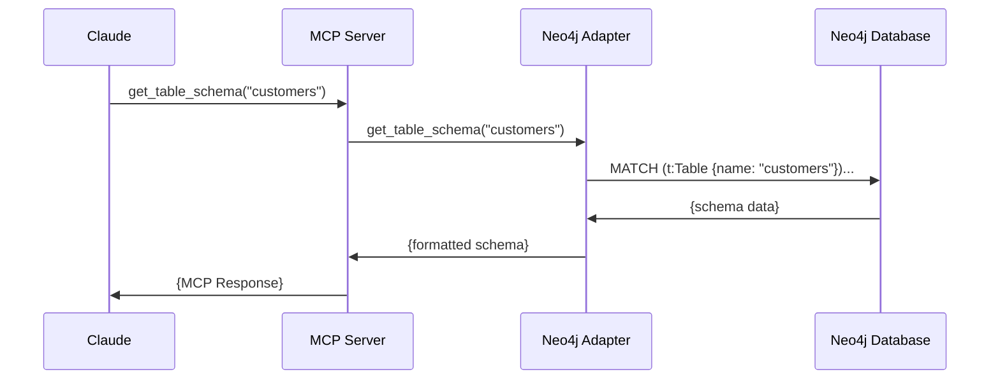

# Model Context Protocol (MCP) Architecture

> **Understanding the Model Context Protocol and its implementation in Text2SQL**

## 1. Introduction to MCP

The Model Context Protocol (MCP) is a standardized way for Large Language Models (LLMs) to interact with external tools, services, and data sources. It enables an LLM like Claude to extend beyond its training data and perform actions in the real world through a consistent interface.

### Core Concepts

MCP is built on several foundational concepts:

- **Resources**: Logical groupings of operations (e.g., "knowledge_graph")
- **Operations**: Individual actions a model can perform (e.g., "query", "get_table_schema")
- **Schemas**: OpenAPI-compatible definitions of the inputs and outputs for operations
- **Resolvers**: Functions that implement the actual operation logic

At its heart, MCP is a JSON-RPC based protocol that allows LLMs to discover available tools, understand their capabilities, and invoke them with appropriate parameters.

### Why MCP Matters

Traditional AI assistants had two main limitations:
- They could only respond with text based on their training
- To access external tools, they needed custom integrations for each one

MCP solves these problems by providing:
- A standard protocol for tool discovery and invocation
- A self-describing interface that models can understand
- A consistent way to handle permissions and trust boundaries
- Extensibility through metadata-driven design

## 2. MCP Architecture in Text2SQL

Our implementation uses a layered architecture to expose the Neo4j Knowledge Graph to LLMs through MCP.

```
┌─────────────────────────────────────────────────────────────┐
│                        LLM (Claude)                          │
└───────────────────────────┬─────────────────────────────────┘
                            │ MCP Protocol (JSON-RPC)
                            ▼
┌─────────────────────────────────────────────────────────────┐
│                    Metadata Registry Server                  │
│                                                             │
│  ┌───────────────┐    ┌────────────┐    ┌───────────────┐   │
│  │ MCP Protocol  │◄──►│ Registry   │◄──►│ Trust Manager │   │
│  │   Handler     │    │ & Discovery│    │               │   │
│  └───────────────┘    └─────┬──────┘    └───────────────┘   │
│           ▲                  │                  ▲            │
│           │                  ▼                  │            │
│           │            ┌────────────┐           │            │
│           └────────────┤  Service   ├───────────┘            │
│                        │  Adapters  │                        │
│                        └─────┬──────┘                        │
└─────────────────────────────┼─────────────────────────────────┘
                              │
                              ▼
┌─────────────────────────────────────────────────────────────┐
│                Neo4j Knowledge Graph Database                │
└─────────────────────────────────────────────────────────────┘
```

### 2.1 Key Components

Our architecture consists of several key components:

#### 2.1.1 Metadata Registry

The Metadata Registry is the central component that:
- Maintains a catalog of available services
- Handles service discovery through various feeds
- Manages service metadata and capabilities
- Implements the service lifecycle

The registry is designed as a singleton that acts as the source of truth for all service information.

#### 2.1.2 Discovery Feeds

Discovery Feeds are responsible for finding services from various sources:

- **FileSystemFeed**: Discovers services from YAML/JSON files
- **HttpDiscoveryFeed**: Polls HTTP endpoints for service metadata
- **PluginDiscoveryFeed**: Loads services from Python modules
- **Custom Feeds**: Can be implemented for other discovery mechanisms

Each feed runs independently and notifies the registry when it discovers services.

#### 2.1.3 MCP Protocol Handler

The MCP Protocol Handler:
- Implements the MCP specification for JSON-RPC
- Exposes resources and operations based on registered services
- Routes requests to the appropriate service adapters
- Handles request/response formatting and validation

It acts as the bridge between the LLM and the services registered in the Metadata Registry.

#### 2.1.4 Service Adapters

Service Adapters connect the MCP layer to actual service implementations:

- **Neo4jAdapter**: Connects to the Neo4j Knowledge Graph
- **Other adapters**: Can be implemented for different services

Adapters translate between the MCP protocol and the service's native API.

#### 2.1.5 Trust Manager

The Trust Manager enforces security boundaries:
- Verifies services against security policies
- Manages consent for sensitive operations
- Implements permission checking
- Provides audit logging for security events

It acts as a gatekeeper to ensure operations are performed securely.

## 3. Service Discovery Deep Dive

One of the most powerful aspects of our implementation is dynamic service discovery.

### 3.1 Discovery Mechanisms

Our system supports multiple discovery mechanisms:

#### 3.1.1 File-Based Discovery

```
┌─────────────────┐     ┌────────────────┐     ┌─────────────┐
│ YAML/JSON Files │────►│ FileSystemFeed │────►│             │
└─────────────────┘     └────────────────┘     │             │
                                               │             │
┌─────────────────┐     ┌────────────────┐     │  Metadata  │
│ HTTP Endpoints  │────►│HttpDiscoveryFeed│────►│  Registry  │
└─────────────────┘     └────────────────┘     │             │
                                               │             │
┌─────────────────┐     ┌────────────────┐     │             │
│ Python Modules  │────►│ PluginFeed     │────►│             │
└─────────────────┘     └────────────────┘     └─────────────┘
```

File-based discovery monitors directories for YAML/JSON files containing service definitions. It supports both event-based notification (using the watchdog library) for immediate updates and polling for environments where filesystem events aren't available.

Example service definition:
```yaml
service_id: kg-neo4j
name: knowledge_graph
description: "Knowledge Graph for text-to-SQL operations"
operations:
  - name: query
    description: "Run a Cypher query against the knowledge graph"
    schema: { ... }
```

#### 3.1.2 HTTP-Based Discovery

HTTP-based discovery polls configured endpoints for service definitions. This allows for federated service discovery across multiple systems.

#### 3.1.3 Plugin-Based Discovery

Plugin-based discovery loads Python modules that define services programmatically. This is useful for complex services that need custom initialization logic.

#### 3.1.4 API-Based Registration

Services can register themselves via a REST API:
- `POST /services`: Register a new service
- `PUT /services/{id}`: Update a service
- `DELETE /services/{id}`: Remove a service
- `GET /services`: List all services

This enables dynamic service registration from any application.

### 3.2 Service Lifecycle

Services follow a defined lifecycle:

1. **Discovery**: Service is found by a discovery feed
2. **Validation**: Service definition is validated
3. **Registration**: Service is added to the registry
4. **Verification**: Service is verified by the Trust Manager
5. **Exposure**: Service is exposed via MCP
6. **Updates**: Service can be updated if a newer version is found
7. **Removal**: Service can be removed if source disappears

This lifecycle ensures services are properly managed throughout their existence.

## 4. Knowledge Graph Operations

The primary service in our implementation is the Neo4j Knowledge Graph service, which provides several operations:

### 4.1 Core Operations

- **query**: Executes a Cypher query against the knowledge graph
- **get_table_schema**: Retrieves detailed schema information for a table
- **find_relationships**: Discovers paths between entities in the graph
- **search_business_terms**: Searches for business terms by keyword
- **recommend_tables_for_query**: Suggests relevant tables for a query

### 4.2 Example: Table Schema Operation



This operation provides Claude with detailed table metadata, including columns, data types, relationships, and business descriptions.

## 5. Architecture Patterns

Our implementation leverages several architectural patterns:

### 5.1 Registry Pattern

The Metadata Registry uses the Registry pattern to maintain a centralized catalog of services. This allows for:
- Single source of truth for service information
- Centralized management of service lifecycle
- Consistent interface for service discovery

### 5.2 Adapter Pattern

Service Adapters use the Adapter pattern to translate between the MCP protocol and service-specific APIs. This provides:
- Clean separation between protocol and implementation
- Ability to integrate diverse services with minimal code changes
- Consistent error handling and response formatting

### 5.3 Observer Pattern

Discovery Feeds use the Observer pattern to notify the registry of discovered services. This enables:
- Loose coupling between discovery mechanisms and registry
- Ability to add new discovery feeds without modifying core code
- Parallel discovery from multiple sources

### 5.4 Singleton Pattern

The registry is implemented as a Singleton to ensure:
- Consistent state across the application
- Single point of access for service information
- Efficient resource usage

## 6. Security Considerations

Security is a key concern in our MCP implementation:

### 6.1 Trust Boundaries

The Trust Manager establishes clear trust boundaries:
- **Service Verification**: Ensures services are from trusted sources
- **Operation Consent**: Requires approval for sensitive operations
- **Permission Management**: Restricts access based on policies

### 6.2 Input Validation

All operation inputs are validated against their schemas to prevent:
- Injection attacks in Cypher queries
- Malformed inputs causing system errors
- Unauthorized access to data

### 6.3 Secure Configuration

Sensitive information like database credentials is handled securely:
- Environment variables for secrets
- Configuration separation from code
- No hardcoded credentials

## 7. Performance Optimizations

Our implementation includes several performance optimizations:

### 7.1 Asynchronous Discovery

Discovery feeds operate asynchronously to avoid blocking:
- Each feed runs in its own thread
- Event-based notification where available
- Configurable polling intervals

### 7.2 Efficient Service Lookup

Service operations are optimized for fast lookup:
- In-memory registry for performance
- Indexing by service ID and operation name
- Caching of frequently used services

### 7.3 Connection Pooling

Database connections are managed efficiently:
- Neo4j driver uses connection pooling
- Reuse of connections across requests
- Proper cleanup of resources

## 8. Integration with Text2SQL

The MCP implementation integrates with the Text2SQL system:

### 8.1 Knowledge Graph Access

The primary integration point is the Knowledge Graph:
- MCP exposes the same graph database used by Text2SQL
- Queries can access the semantic schema built by Text2SQL
- Results feed back into the LLM's understanding

### 8.2 Shared Configuration

Configuration is shared across components:
- Same Neo4j connection parameters
- Consistent environment variable names
- Common logging and monitoring

### 8.3 Complementary Capabilities

MCP and Text2SQL work together:
- Text2SQL builds and maintains the Knowledge Graph
- MCP exposes the graph to LLMs
- LLMs use the graph to generate better SQL

## 9. Extending the System

The system is designed for extensibility:

### 9.1 Adding New Services

To add a new service:

1. Create a service definition (YAML/JSON/Python)
2. Implement a service adapter if needed
3. Register the service using any discovery mechanism

No changes to the core MCP code are required.

### 9.2 Adding New Discovery Feeds

To add a new discovery feed:

1. Implement the `DiscoveryFeed` interface
2. Register the feed with the Feed Manager
3. Configure the feed as needed

This allows for custom discovery from any source.

### 9.3 Enhancing Operations

To enhance existing operations:

1. Update the service definition with new parameters or descriptions
2. Modify the adapter implementation
3. The changes are automatically reflected in the MCP interface

## 10. Usage Examples

### 10.1 Basic Usage with Claude

```python
from mcp.client import Client

# Connect to the MCP server
client = Client("http://localhost:8234")

# Get available resources
resources = await client.get_resources()

# Find the Knowledge Graph resource
kg = next(r for r in resources if r.name == "knowledge_graph")

# Execute a query
result = await kg.query(
    query="MATCH (t:Table) RETURN t.name LIMIT 5"
)

# Get schema for a table
schema = await kg.get_table_schema(
    table_name="customers"
)

# Find relationships between tables
relationships = await kg.find_relationships(
    source="customers",
    target="orders"
)
```

### 10.2 Registering a Custom Service

```python
# Create service definition
service = {
    "service_id": "custom-service",
    "name": "custom_service",
    "description": "Custom service example",
    "operations": [
        {
            "name": "custom_operation",
            "description": "Custom operation example",
            "schema": {
                "type": "object",
                "properties": {
                    "param": {"type": "string"}
                }
            }
        }
    ]
}

# Register via API
import requests
response = requests.post(
    "http://localhost:8235/services",
    json=service
)
```

## 11. Future Directions

Our MCP implementation has several potential future directions:

### 11.1 Enhanced Discovery

- **Service Mesh Integration**: Discover services from Kubernetes/Istio
- **Registry Federation**: Connect multiple registries across environments
- **Dynamic Reconfiguration**: Update configuration without restarts

### 11.2 Advanced Security

- **Fine-grained Access Control**: Operation-level permissions
- **OAuth Integration**: Token-based authentication and authorization
- **Audit Logging**: Comprehensive security event recording

### 11.3 Extended Capabilities

- **Bidirectional Streaming**: Support for streaming responses
- **Batch Operations**: Efficient batching of multiple requests
- **Conditional Requests**: Operations based on preconditions

## 12. Conclusion

The Model Context Protocol implementation in Text2SQL provides a powerful bridge between LLMs and the Knowledge Graph. Through a metadata-centric approach, dynamic discovery, and clean architecture, it enables Claude to leverage the full power of the semantic schema for text-to-SQL generation.

The combination of flexible service discovery, robust security, and efficient performance creates a system that can grow and adapt to changing needs while maintaining a consistent and reliable interface for AI models.

By following established patterns and designing for extensibility, our implementation provides not just current functionality but a foundation for future enhancements and integrations.