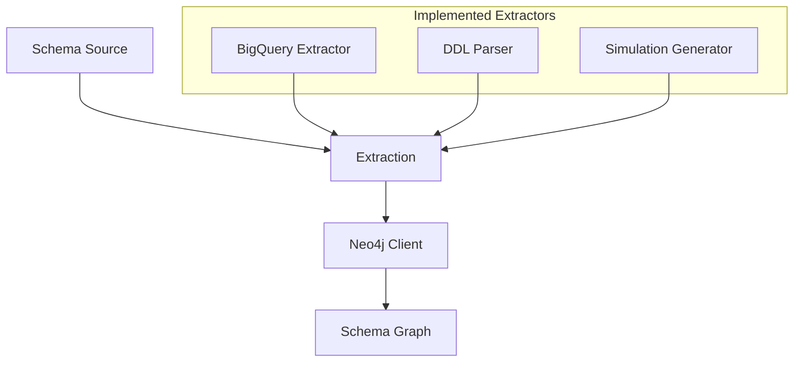
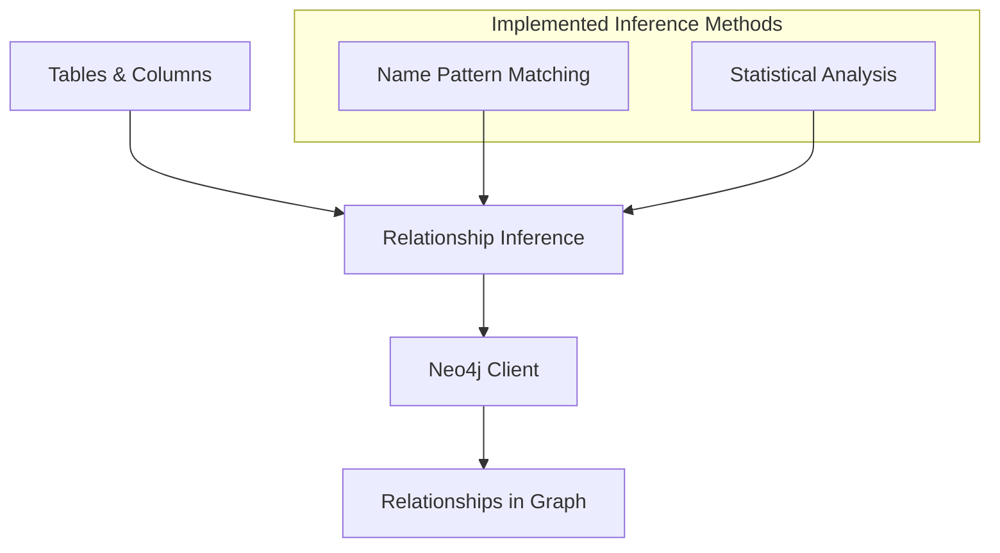
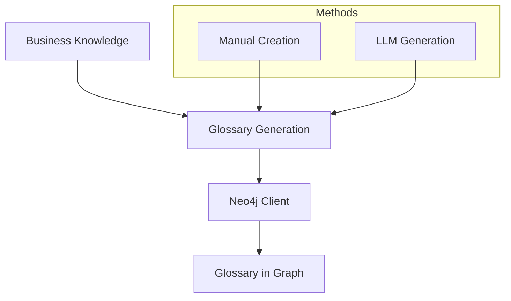
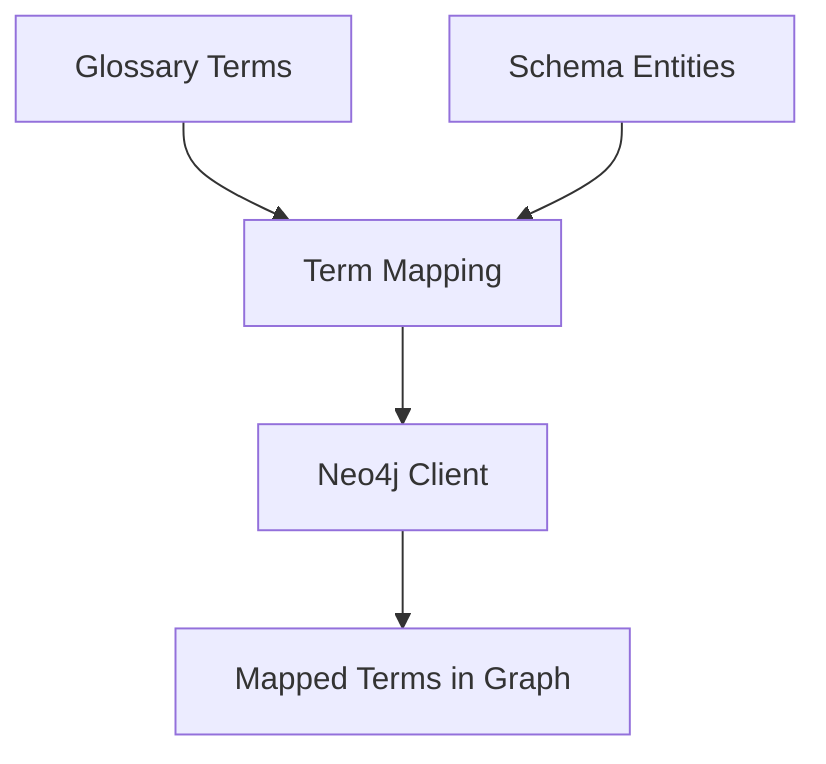
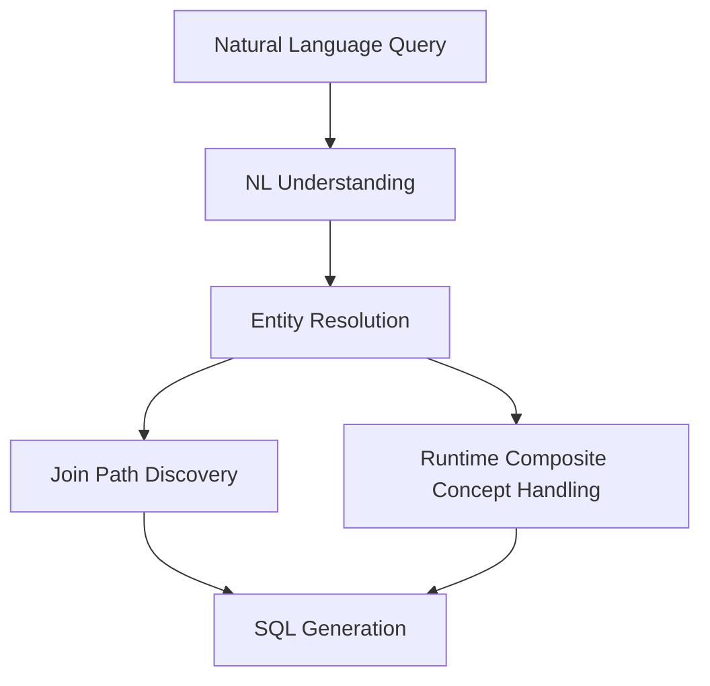
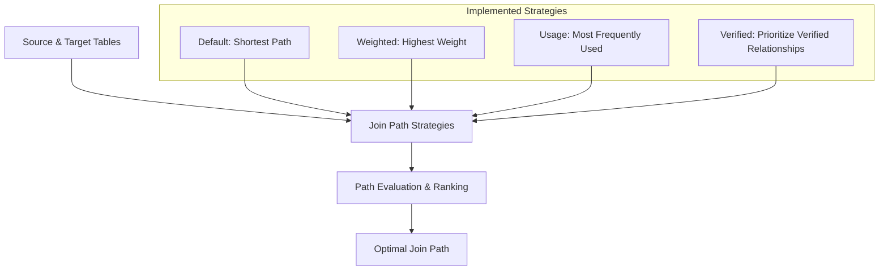

# Semantic Graph Flow in GraphAlchemy

This document describes the actual implementation of the semantic graph flow in GraphAlchemy, focusing on what is truly implemented rather than aspirational features.

## Overview

The semantic graph is a core component of the GraphAlchemy system, storing both technical schema information and business knowledge. This document outlines the actual flow of information through the semantic graph as implemented in the current codebase.

## 1. Schema Extraction and Loading

The first phase populates the graph with technical schema information:

### Implementation Details:

- **Nodes Created**: `Tenant`, `Dataset`, `Table`, `Column`
- **Relationships Created**: `OWNS`, `CONTAINS`, `HAS_COLUMN`
- **Main Implementation**: `neo4j_client.py` contains methods for storing schema entities

### Key Methods:
- `create_tenant()`
- `create_dataset()`
- `create_table()`
- `create_column()`

## 2. Relationship Inference

The second phase discovers relationships between entities:

### Implementation Details:

- **Relationships Created**: `LIKELY_REFERENCES` (between columns)
- **Properties Set**: `confidence`, `weight`, `detection_method`
- **Main Implementation**: `relationship_inference/` directory contains inference implementations

### Key Methods:
- `create_relationship()`
- `update_relationship_weight()`
- `verify_relationship()`

## 3. Business Glossary Creation

The third phase adds business knowledge to the technical schema:

### Implementation Details:

- **Nodes Created**: `BusinessGlossary`, `GlossaryTerm`, `BusinessMetric`
- **Relationships Created**: `HAS_TERM`, `HAS_METRIC`
- **Main Implementation**: Various scripts in the `glossary/` directory

### Key Methods:
- `store_business_glossary()`
- `get_glossary_terms()`
- `get_glossary_term_details()`

## 4. Term Mapping

The fourth phase connects business terms to technical entities:

### Implementation Details:

- **Relationships Created**: `MAPS_TO` (from GlossaryTerm to Table/Column)
- **Properties Set**: `usage_count`, `weight`
- **Main Implementation**: Term mapping is implemented but there is no dedicated module

### Key Methods:
- `update_term_mapping_usage()`
- `get_term_mapping_stats()`

## 5. Query Resolution Flow

The query resolution phase leverages the graph to transform natural language to SQL:

### Implementation Details for Entity Resolution:

- **Process**: Maps entity mentions to actual tables/columns using graph lookups
- **Main Implementation**: `query_resolution.py` in the `components` directory
- **Methods**: 
  - `_resolve_entities()`
  - `_resolve_attributes()`

### Implementation Details for Join Path Discovery:

- **Process**: Finds optimal paths between tables for generating joins
- **Main Implementation**: `neo4j_client.py` contains methods for path discovery
- **Methods**:
  - `find_join_paths()`
  - `_find_default_join_paths()`
  - `_find_weighted_join_paths()`
  - `_find_usage_based_join_paths()`
  - `_find_verified_join_paths()`

### Runtime Composite Concept Handling (NOT Persistent):

- **Process**: Dynamically combines terms to handle complex concepts
- **Main Implementation**: `query_resolution.py` contains runtime handling
- **Methods**:
  - `_detect_composite_concepts()`
  - `_resolve_composite_concept()`
  - `_resolve_semantic_concepts()`

## Join Path Discovery In Detail

The join path traversal is a critical component implemented in Neo4jClient:

### Implementation Details:

1. **Multiple strategies** are implemented for finding join paths:
   - `_find_default_join_paths()`: Shortest path with highest confidence
   - `_find_weighted_join_paths()`: Path with highest total weight
   - `_find_usage_based_join_paths()`: Path with highest usage count
   - `_find_verified_join_paths()`: Path with most verified relationships

2. **Cypher path finding** is used for efficient graph traversal:
   - Uses Cypher's pathfinding capabilities like `shortestPath()`
   - Applies filters for minimum confidence
   - Limits path length with max_hops parameter

3. **Path ranking mechanism**:
   - Paths are ranked based on a combination of:
     - Path length (shorter is better)
     - Confidence scores (product of all confidences in path)
     - Weights (sum of weights)
     - Verification status

4. **Result formatting** is handled by `_format_path_results()`:
   - Extracts join conditions from paths
   - Formats into structured data for SQL generation

## Runtime Composite Concept Handling

The system handles composite business concepts entirely at runtime:

1. **Detection Phase**:
   - `_detect_composite_concepts()` identifies multi-word concepts from NL queries
   - Combines individual terms for complex concept detection
   - No persistent storage of detected concepts

2. **Resolution Phase**:
   - `_resolve_composite_concept()` interprets detected complex concepts
   - Uses existing GlossaryTerm nodes and their definitions
   - Dynamically generates SQL implementations for these concepts

## Not Yet Implemented

1. **Persistent Composite Concepts**: No persistent storage of composite concepts as nodes
2. **Automated Concept Harvesting**: No mechanism to learn new concepts from usage
3. **Deep Relationship Discovery**: Limited to direct foreign key-like relationships
4. **Complex Transaction Support**: No explicit support for complex DB transactions
5. **Hierarchical Concept Relationships**: No explicit parent-child relationships between concepts

## Accuracy Note

This document reflects the actual implementation based on a thorough code review. Any features described in other documentation but not mentioned here should be considered aspirational rather than implemented.