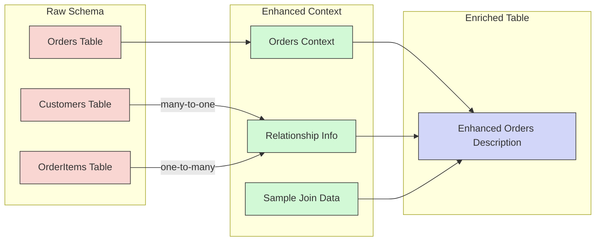
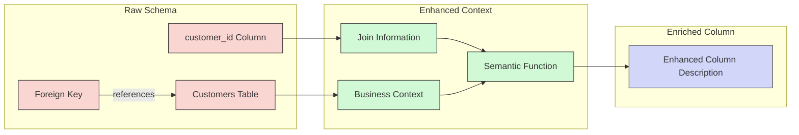
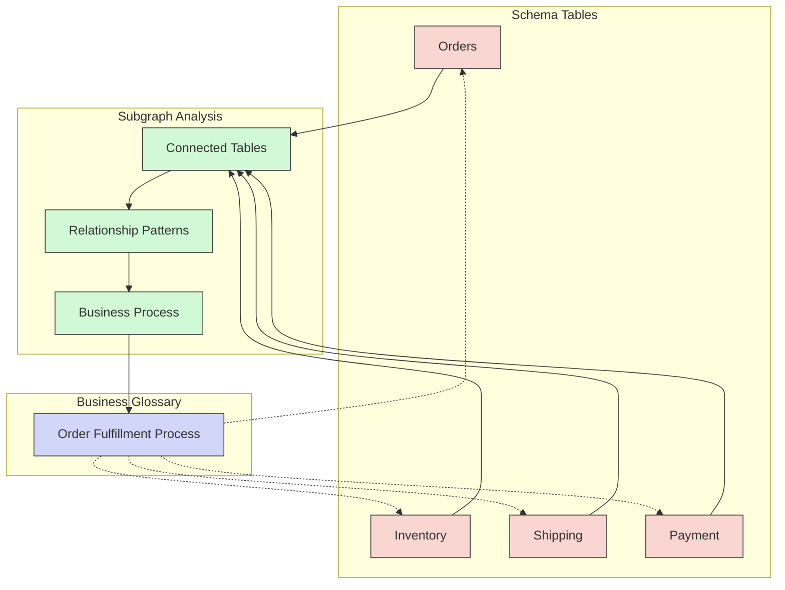
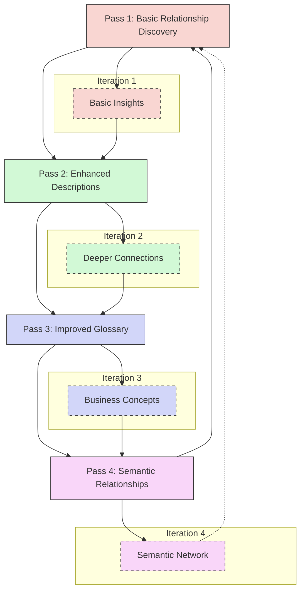
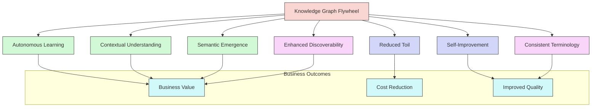

# The Knowledge Graph Flywheel: Value Proposition

The Knowledge Graph Flywheel represents a self-reinforcing approach to semantic understanding that creates compounding value through iterative enhancement. Each stage builds upon the previous, generating increasingly rich semantic context with minimal human intervention.

## 1. Neighborhood-Aware Table Enhancement

When generating table descriptions, we include the relationship neighborhood:

- Pass "parent" and "child" tables as context
- Include relationship types and cardinality
- Show sample data that demonstrates these relationships

**Value Proposition:**
- Tables are understood within their ecosystem, not in isolation
- Descriptions incorporate functional role in data workflows
- Generated metadata captures operational significance
- Cross-functional insights emerge from relationship patterns

**Example Enhancement:**
> "The Orders table relates to Customers (many-to-one) and OrderItems (one-to-many). Consider these relationships when describing its purpose."

## 2. Relationship-Enriched Column Descriptions

When enhancing column metadata, we include relationship participation:

- Identify columns that participate in joins or relationships
- Provide context about the connected tables/columns
- Highlight the business significance of these connections

**Value Proposition:**
- Columns are defined by their relational role, not just data type
- Foreign keys gain semantic meaning beyond technical function
- Query-relevant relationships become immediately apparent
- Data lineage becomes visible through column descriptions

**Example Enhancement:**
> When describing 'customer_id' in Orders, explain it connects to the primary Customers table, representing the purchasing entity responsible for payment and shipping information.

## 3. Graph-Aware Business Glossary

We generate terms based on subgraphs rather than isolated tables:

- For each concept, examine the entire relevant neighborhood
- Define terms based on their interconnected meaning
- Map terms to multiple related tables when appropriate

**Value Proposition:**
- Business concepts span technical boundaries
- Glossary reflects operational reality rather than schema design
- Terms maintain consistency across the data ecosystem
- Natural language queries can resolve across multiple tables

**Example Enhancement:**
> "Order Fulfillment Process" would be defined with knowledge of Orders, Inventory, Shipping, and Payment tables, creating a comprehensive concept that spans the entire fulfillment lifecycle.

## 4. Iterative Enhancement Loop

We run multiple passes of enhancement, with each pass leveraging previous insights:

- First pass: Basic relationship discovery and metadata
- Second pass: Use relationships to enhance descriptions
- Third pass: Use enhanced descriptions to improve glossary
- Final pass: Use glossary to discover additional semantic relationships

**Value Proposition:**
- Compound intelligence grows with each iteration
- Self-correction mechanisms improve quality over time
- Coverage gaps are systematically identified and addressed
- The system becomes more accurate without human intervention

## 5. Progressive Graph Enrichment

```mermaid
flowchart LR
    subgraph Start
        RS[Raw Schema]
    end
    
    subgraph Phase 1
        RE[Relationship<br>Discovery]
        SE[Structural Edges]
    end
    
    subgraph Phase 2
        TE[Table/Column<br>Enhancement]
        RP[Rich Properties]
    end
    
    subgraph Phase 3
        GG[Glossary<br>Generation]
        CN[Concept Nodes]
    end
    
    subgraph Phase 4
        TR[Term<br>Relationships]
        ME[Semantic Edges]
    end
    
    subgraph Result
        KG[Knowledge Graph]
    end
    
    RS --> RE
    RE --> SE
    SE --> TE
    TE --> RP
    RP --> GG
    GG --> CN
    CN --> TR
    TR --> ME
    ME --> KG
    
    style RS fill:#f9f9d2,stroke:#333
    style RE fill:#f9d6d2,stroke:#333
    style SE fill:#f9d6d2,stroke:#333,stroke-dasharray: 5 5
    style TE fill:#d2f9d6,stroke:#333
    style RP fill:#d2f9d6,stroke:#333,stroke-dasharray: 5 5
    style GG fill:#d2d6f9,stroke:#333
    style CN fill:#d2d6f9,stroke:#333,stroke-dasharray: 5 5
    style TR fill:#f9d6f9,stroke:#333
    style ME fill:#f9d6f9,stroke:#333,stroke-dasharray: 5 5
    style KG fill:#d2f9f9,stroke:#333
```

As each component runs, it adds new nodes, edges, and properties:

- Relationship discovery creates structural edges
- Table/column enhancement adds rich properties
- Glossary generation creates concept nodes and mappings
- Term relationships create semantic edges

**Value Proposition:**
- The graph becomes progressively more valuable with minimal effort
- Business intelligence emerges organically from technical metadata
- The semantic layer evolves alongside schema changes
- Cross-domain insights become discoverable through graph traversal

## Overall Business Impact

The Knowledge Graph Flywheel transforms raw schema into business intelligence through:

1. **Autonomous Learning** - The system teaches itself about your data
2. **Contextual Understanding** - Each element gains meaning from its relationships
3. **Semantic Emergence** - Business concepts form naturally from technical elements
4. **Self-Improvement** - Quality improves automatically with each iteration
5. **Reduced Toil** - Manual metadata management becomes unnecessary
6. **Enhanced Discoverability** - Users can find data through natural language
7. **Consistent Terminology** - Business language aligns across the organization

This approach eliminates the traditional trade-off between comprehensive metadata and maintenance costs, creating a self-sustaining system that continuously improves its understanding of your data landscape.