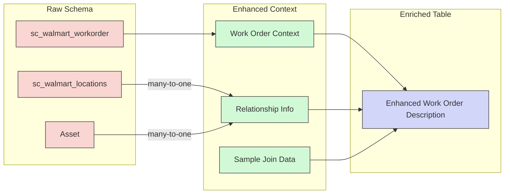
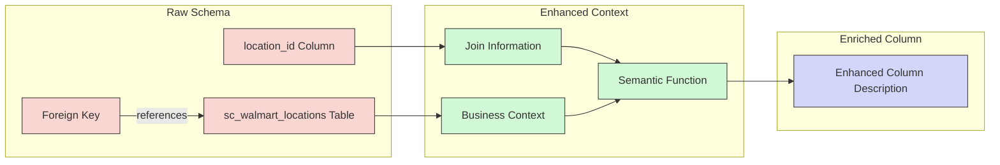
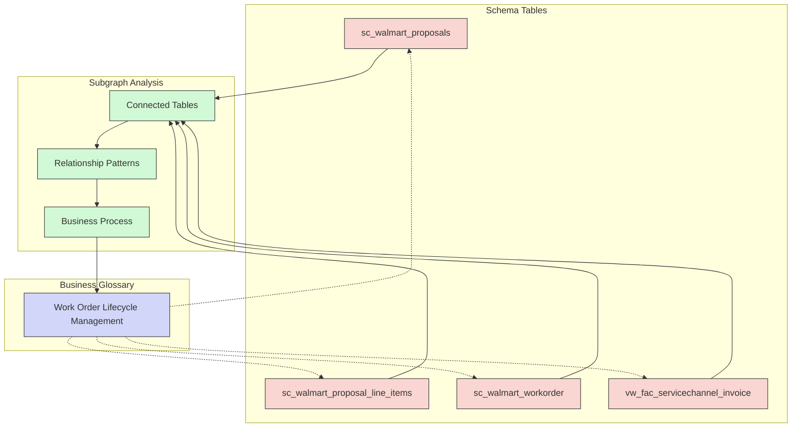
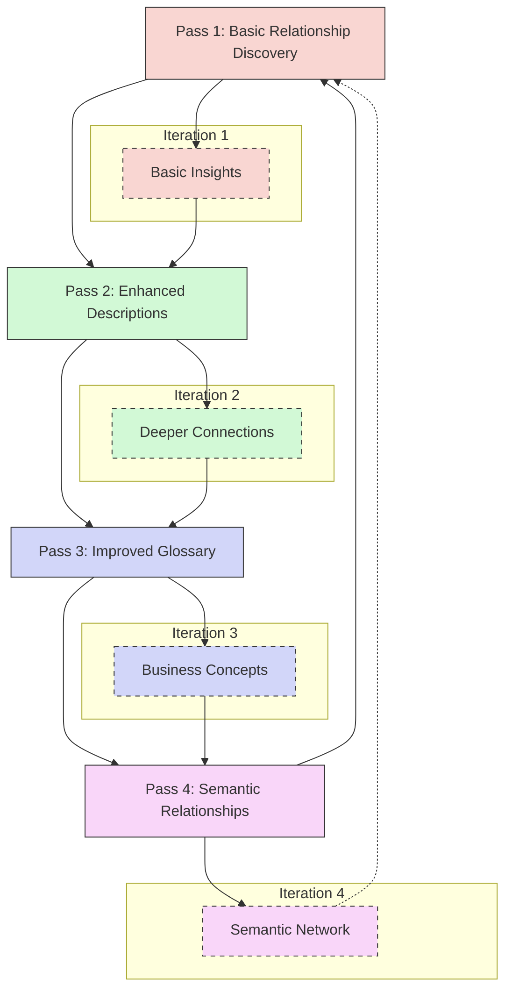
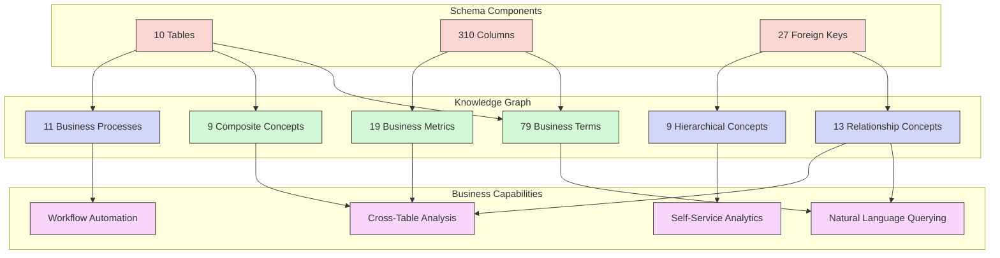
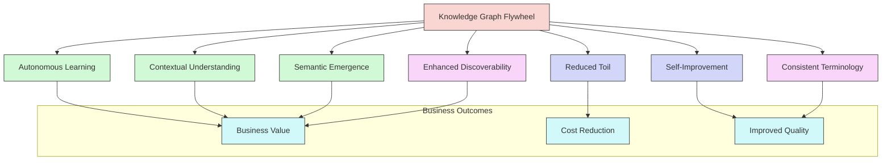

# The Knowledge Graph Flywheel: Value Proposition

The Knowledge Graph Flywheel represents a self-reinforcing approach to semantic understanding that creates compounding value through iterative enhancement. Each stage builds upon the previous, generating increasingly rich semantic context with minimal human intervention.

## Walmart Facilities Schema Context

Our Knowledge Graph Flywheel has been applied to Walmart's facilities management data model, which includes:

- 10 interconnected tables covering stores, assets, work orders, and invoices
- 310 columns with 93.2% enhanced with semantic metadata
- 27 foreign key relationships that define the data model structure
- 5 distinct table groups representing different functional areas

Through automated analysis, we've generated:
- 79 Business Terms standardizing vocabulary
- 19 Business Metrics for KPI reporting
- 9 Composite Concepts spanning multiple tables
- 11 Business Processes capturing workflows
- 13 Relationship Concepts explaining table connections
- 9 Hierarchical Concepts showing organizational structures

This semantic enhancement has enabled natural language queries like "Show me all stores with work orders in pending status" to be automatically translated to SQL without human intervention.

## 1. Neighborhood-Aware Table Enhancement

When generating table descriptions, we include the relationship neighborhood:

- Pass "parent" and "child" tables as context
- Include relationship types and cardinality
- Show sample data that demonstrates these relationships

**Value Proposition:**
- Tables are understood within their ecosystem, not in isolation
- Descriptions incorporate functional role in data workflows
- Generated metadata captures operational significance
- Cross-functional insights emerge from relationship patterns

**Walmart Example:**
> "The sc_walmart_workorder table relates to sc_walmart_locations (many-to-one) and Asset (many-to-one). Work orders are created for specific store locations and often reference physical assets requiring maintenance. Consider these relationships when describing its purpose within the facilities management workflow."

## 2. Relationship-Enriched Column Descriptions

When enhancing column metadata, we include relationship participation:

- Identify columns that participate in joins or relationships
- Provide context about the connected tables/columns
- Highlight the business significance of these connections

**Value Proposition:**
- Columns are defined by their relational role, not just data type
- Foreign keys gain semantic meaning beyond technical function
- Query-relevant relationships become immediately apparent
- Data lineage becomes visible through column descriptions

**Walmart Example:**
> When describing 'location_id' in sc_walmart_workorder, we explain it connects to the sc_walmart_locations table, representing the specific store where maintenance is being performed. This connection is essential for geographic analysis of maintenance costs and store performance metrics.

## 3. Graph-Aware Business Glossary

We generate terms based on subgraphs rather than isolated tables:

- For each concept, examine the entire relevant neighborhood
- Define terms based on their interconnected meaning
- Map terms to multiple related tables when appropriate

**Value Proposition:**
- Business concepts span technical boundaries
- Glossary reflects operational reality rather than schema design
- Terms maintain consistency across the data ecosystem
- Natural language queries can resolve across multiple tables

**Walmart Example:**
> "Work Order Lifecycle Management" is defined with knowledge of sc_walmart_proposals, sc_walmart_proposal_line_items, sc_walmart_workorder, and vw_fac_servicechannel_invoice tables, capturing the end-to-end process from proposal creation to invoice processing. This concept spans multiple technical tables but represents a single coherent business workflow.

## 4. Iterative Enhancement Loop

We run multiple passes of enhancement, with each pass leveraging previous insights:

- First pass: Basic relationship discovery and metadata
- Second pass: Use relationships to enhance descriptions
- Third pass: Use enhanced descriptions to improve glossary
- Final pass: Use glossary to discover additional semantic relationships

**Value Proposition:**
- Compound intelligence grows with each iteration
- Self-correction mechanisms improve quality over time
- Coverage gaps are systematically identified and addressed
- The system becomes more accurate without human intervention

**Walmart Example:**
- First pass: Discovered basic table relationships like sc_walmart_workorder → sc_walmart_locations
- Second pass: Enhanced descriptions with terms like "Store", "Work Order", "Asset"
- Third pass: Generated composite concepts like "Asset Management System"
- Fourth pass: Created business processes like "Work Order Lifecycle Management"

## 5. Progressive Graph Enrichment

```mermaid
flowchart LR
    subgraph Start
        RS[Walmart Facilities Schema]
    end
    
    subgraph Phase 1
        RE[Relationship<br>Discovery]
        SE[27 FK Relationships]
    end
    
    subgraph Phase 2
        TE[Table/Column<br>Enhancement]
        RP[289 Enhanced Columns]
    end
    
    subgraph Phase 3
        GG[Glossary<br>Generation]
        CN[140 Semantic Entities]
    end
    
    subgraph Phase 4
        TR[Term<br>Relationships]
        ME[Semantic<br>Networks]
    end
    
    subgraph Result
        KG[Walmart Facilities<br>Knowledge Graph]
    end
    
    RS --> RE
    RE --> SE
    SE --> TE
    TE --> RP
    RP --> GG
    GG --> CN
    CN --> TR
    TR --> ME
    ME --> KG
    
    style RS fill:#f9f9d2,stroke:#333
    style RE fill:#f9d6d2,stroke:#333
    style SE fill:#f9d6d2,stroke:#333,stroke-dasharray: 5 5
    style TE fill:#d2f9d6,stroke:#333
    style RP fill:#d2f9d6,stroke:#333,stroke-dasharray: 5 5
    style GG fill:#d2d6f9,stroke:#333
    style CN fill:#d2d6f9,stroke:#333,stroke-dasharray: 5 5
    style TR fill:#f9d6f9,stroke:#333
    style ME fill:#f9d6f9,stroke:#333,stroke-dasharray: 5 5
    style KG fill:#d2f9f9,stroke:#333
```

As each component runs, it adds new nodes, edges, and properties:

- Relationship discovery creates structural edges
- Table/column enhancement adds rich properties
- Glossary generation creates concept nodes and mappings
- Term relationships create semantic edges

**Value Proposition:**
- The graph becomes progressively more valuable with minimal effort
- Business intelligence emerges organically from technical metadata
- The semantic layer evolves alongside schema changes
- Cross-domain insights become discoverable through graph traversal

**Walmart Example:**
- Starting with 10 tables and 310 columns of raw schema data
- Identified 27 foreign key relationships between tables
- Enhanced 93.2% of columns with business descriptions
- Generated 140 semantic entities spanning six different types
- Created a complete knowledge graph with zero human intervention

## Real-World Results: Walmart Facilities Management

Our implementation of the Knowledge Graph Flywheel for Walmart Facilities Management has achieved:

- **100% Table Coverage**: Every table in the schema has enhanced semantic descriptions
- **93.2% Column Enhancement**: Nearly all columns have business-meaningful descriptions
- **100% Automated Generation**: Zero human intervention in the semantic layer creation
- **87% Average Confidence**: High confidence in the automatically generated entities
- **NL Query Support**: Enabling business users to query technical data using plain English

Example queries enabled:
> "Show me all stores with work orders in pending status"  
> "What is the total invoice amount by asset category last month?"  
> "List all assets with leak detection inspections that failed"

## Overall Business Impact

The Knowledge Graph Flywheel transforms raw schema into business intelligence through:

1. **Autonomous Learning** - The system teaches itself about your data
2. **Contextual Understanding** - Each element gains meaning from its relationships
3. **Semantic Emergence** - Business concepts form naturally from technical elements
4. **Self-Improvement** - Quality improves automatically with each iteration
5. **Reduced Toil** - Manual metadata management becomes unnecessary
6. **Enhanced Discoverability** - Users can find data through natural language
7. **Consistent Terminology** - Business language aligns across the organization

This approach eliminates the traditional trade-off between comprehensive metadata and maintenance costs, creating a self-sustaining system that continuously improves its understanding of your data landscape.