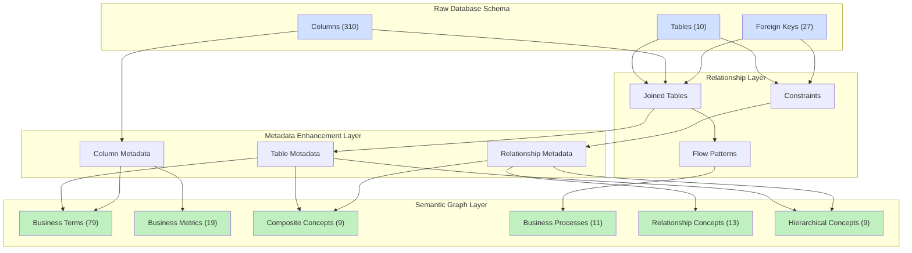
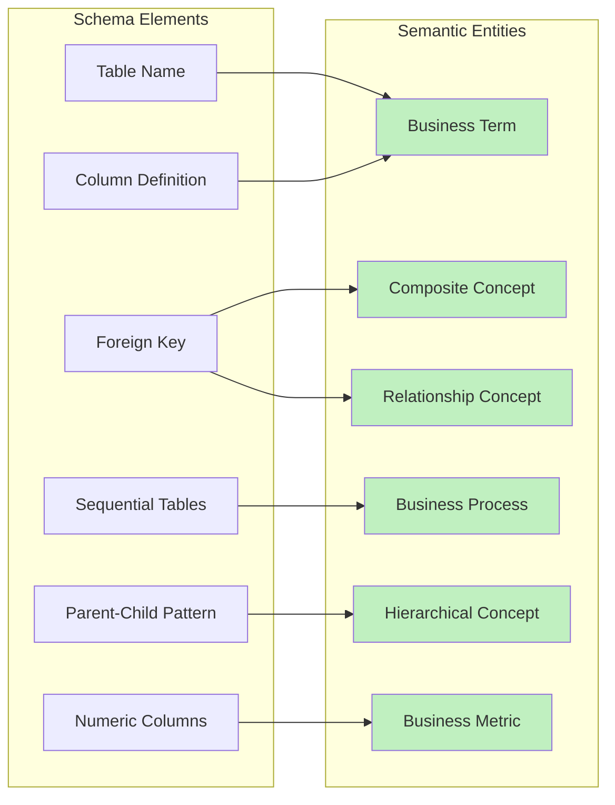
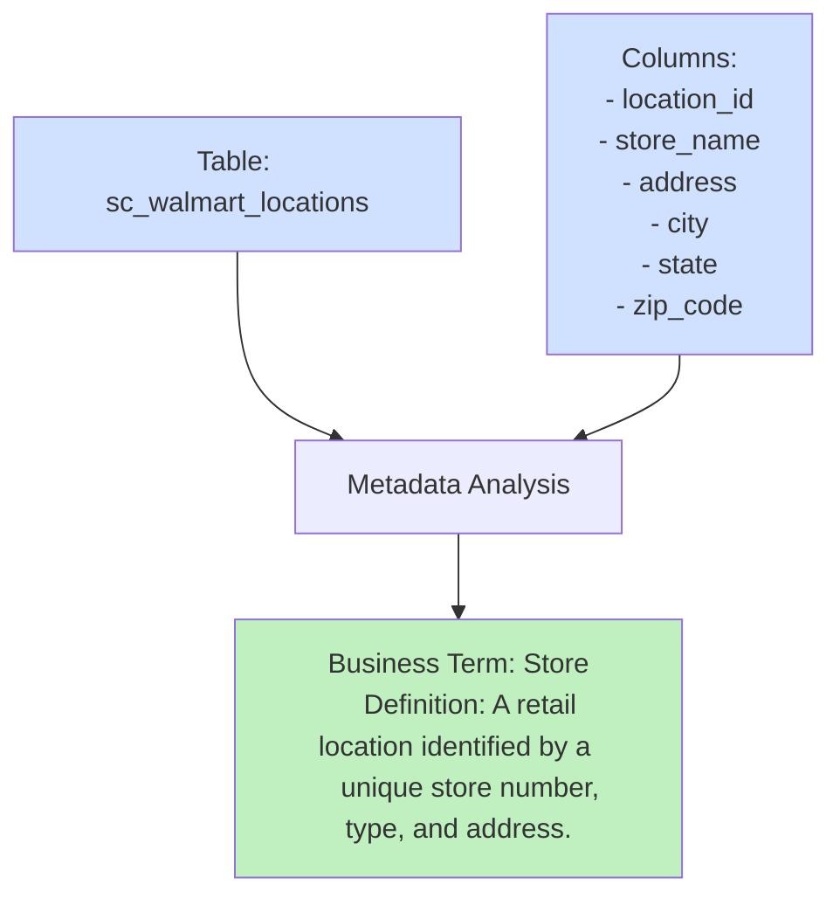
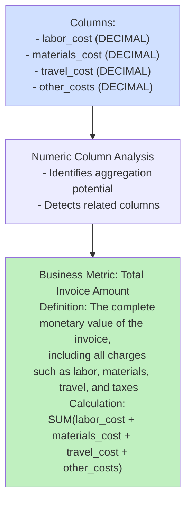
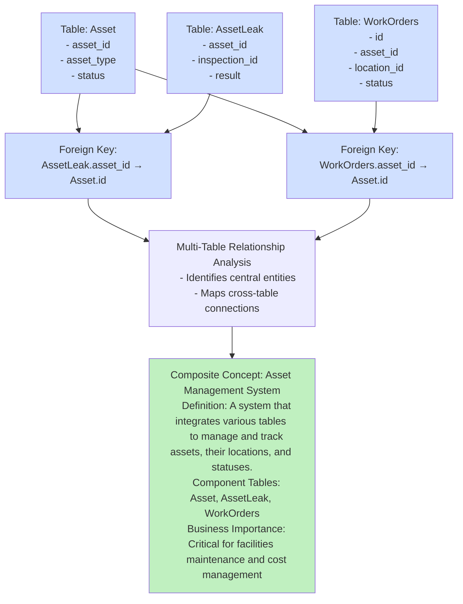
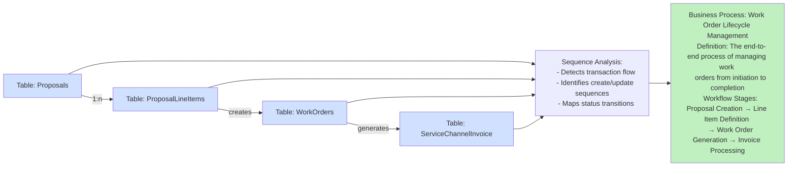
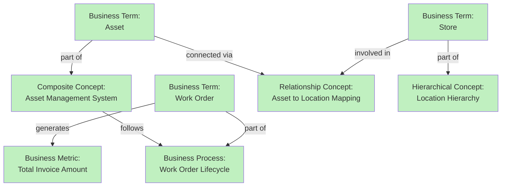
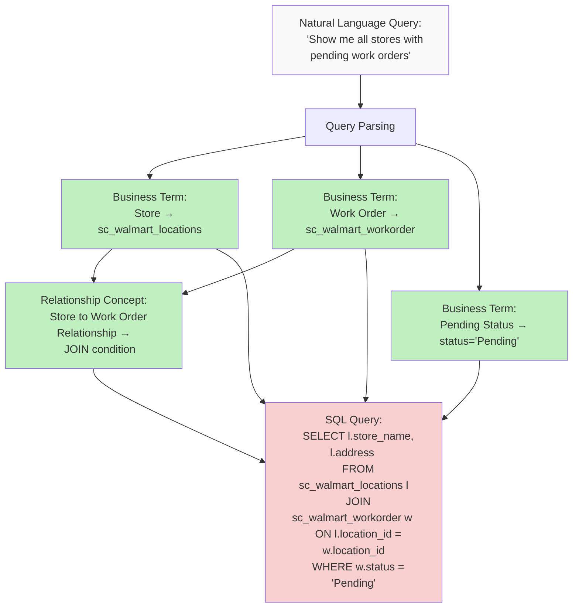
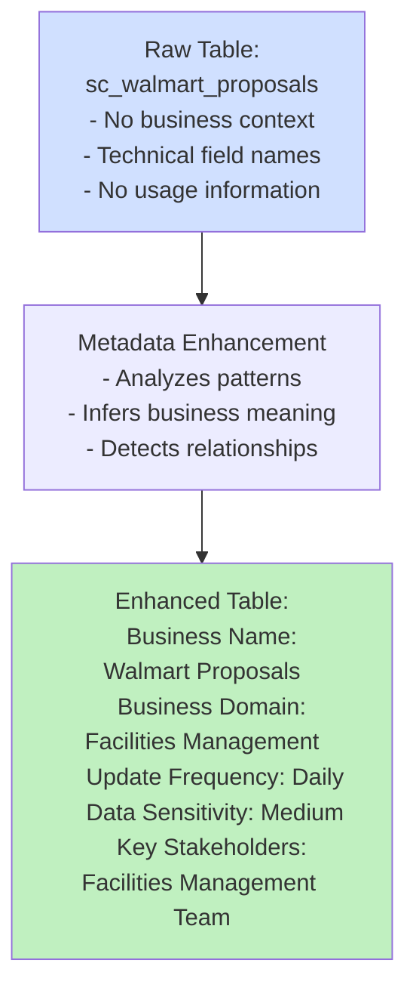
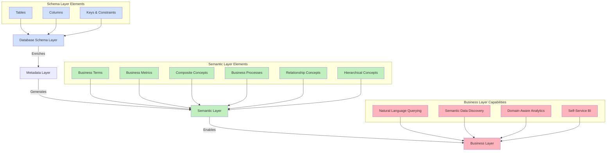

# Semantic Graph Visualizations: Connecting Schema to Business Meaning

This document provides visual representations of how the semantic graph connects to the underlying schema, illustrating the automatic transformation of technical database elements into business-meaningful concepts.

## 1. Architectural Overview

The following diagram shows the layers of transformation from raw database schema to semantic graph:

## 2. Entity-Schema Mapping Details

This diagram illustrates how specific schema elements map to semantic graph entities:

## 3. Business Term Generation Example

## 4. Business Metric Generation Example

## 5. Composite Concept Generation Example

## 6. Business Process Generation Example

## 7. Cross-Entity Semantic Graph

This diagram shows how different entity types form a semantic network:

## 8. Natural Language Query Processing Flow

## 9. Metadata Enrichment Visualization

## 10. Schema to Semantic Integration View

These diagrams are created using Mermaid syntax and should render in markdown viewers that support it (including GitHub). The visualizations provide a clear picture of how the semantic graph connects to and enhances the underlying schema, automatically transforming technical database elements into business-meaningful entities.